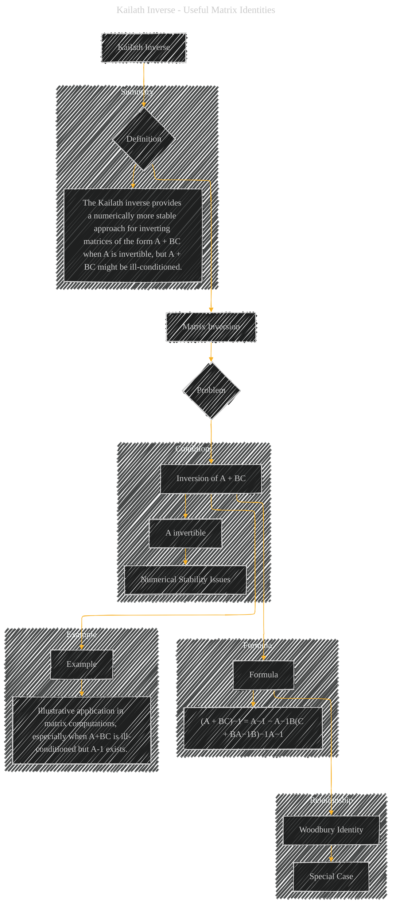

# Kailath Inverse
> **Disclaimer:**
>
> This document contains my personal notes on the topic,
> compiled from publicly available documentation and various cited sources.
> The materials are intended for educational purposes, personal study, and reference.
> The content is dual-licensed:
> 1. **MIT License:** Applies to all code implementations (Swift, Mermaid, and other programming languages).
> 2. **Creative Commons Attribution 4.0 International License (CC BY 4.0):** Applies to all non-code content, including text, explanations, diagrams, and illustrations.
---

## A Diagram Structure

----

### Explanation of the Diagram

The diagram visually outlines the Kailath inverse, focusing on its relationship to matrix inversion, the conditions under which it's useful, its formula, and a conceptual example.

* **A[Kailath Inverse]:** The main topic.
* **B{Definition}:** The Kailath inverse is a specific method for inverting a matrix of the form `A + BC`.
* **C[Matrix Inversion]:** The core problem is about finding the inverse of a matrix.
* **D{Problem}:** The problem is focused on inverting `A + BC`, and the conditions under which direct inversion might be unstable.
* **E["Inversion of A + BC"]:** This is the matrix operation that the Kailath inverse addresses.
* **EA[A invertible]:** A key condition for the Kailath inverse to be applicable and the inverse of A to exist.
* **EB[Numerical Stability Issues]:** Direct inversion of `A + BC` can be problematic if `A + BC` is ill-conditioned, even when `A` is invertible.
* **EC[Formula]:** The core of the Kailath inverse, showing the formula for the inverse of `A + BC` in terms of the inverse of `A`.
* **ED["(A + BC)−1 = A−1 − A−1B(C + BA−1B)−1A−1"]:** The explicit formula for the Kailath inverse.
* **EF[Woodbury Identity]:** The Kailath inverse is a special case of the Woodbury identity.
* **EG[Special Case]:** Explicitly stating that the Kailath inverse is a particular instance of the more general Woodbury identity.
* **EH[Example]:** The diagram includes a placeholder for a conceptual example, illustrating situations where the Kailath inverse is useful.
* **EI["Illustrative application in matrix computations, especially when A+BC is ill-conditioned but A-1 exists."]:** A description of when to apply the Kailath inverse.
* **BF["The Kailath inverse provides a numerically more stable approach for inverting matrices of the form A + BC when A is invertible, but A + BC might be ill-conditioned."]:** A summary of the Kailath inverse's advantages.

This structured diagram, utilizing Mermaid, clearly conveys the key concepts and significance of the Kailath inverse.  It highlights the context, the formula, and the conditions for its practical application, which are essential for understanding this mathematical concept. Remember that the example in `EH` can be further expanded with specific numerical or illustrative examples based on the particular application area.

---
**Licenses:**

- **MIT License:**   - Full text in [LICENSE](LICENSE) file.
- **Creative Commons Attribution 4.0 International:**  - Legal details in [LICENSE-CC-BY](LICENSE-CC-BY) and at [Creative Commons official site](http://creativecommons.org/licenses/by/4.0/).

---