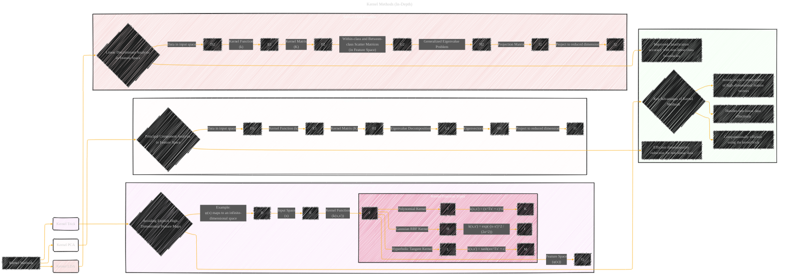

# Kernel Methods In-Depth
> **Disclaimer:**
>
> This document contains my personal notes on the topic,
> compiled from publicly available documentation and various cited sources.
> The materials are intended for educational purposes, personal study, and reference.
> The content is dual-licensed:
> 1. **MIT License:** Applies to all code implementations (Swift, Mermaid, and other programming languages).
> 2. **Creative Commons Attribution 4.0 International License (CC BY 4.0):** Applies to all non-code content, including text, explanations, diagrams, and illustrations.
---

## Kernel Methods In-Depth Visualization

---

### Explanation

* **Kernel Trick:** The core concept is highlighted by the subgraph "Kernel Trick Example."  It clearly shows how the kernel function `k(x, x')` acts as a bridge between the input space and the potentially high-dimensional feature space `φ(x)`, bypassing the need to explicitly compute or store `φ(x)`. This is represented by the example of mapping to an infinite-dimensional space, but a visual mapping to a 3D space would be more understandable.

* **Kernel Function Types:**  A further breakdown of different kernel functions (`Gaussian RBF`, `Polynomial`, `Hyperbolic Tangent`) shows the variety of kernel choices, each with its own mathematical form.  Illustrative equations would significantly improve understanding.

* **Kernel PCA and Kernel LDA:** These subgraphs show how PCA and LDA are adapted to work in the feature space using the kernel trick. The diagrams emphasize the use of the kernel matrix `K` and the eigenvalue decomposition in the feature space for dimensionality reduction or classification.

* **Summary:** The "Summary" subgraph highlights the main advantages of kernel methods, focusing on their ability to handle non-linear data and the computational efficiency of the kernel trick.

---

### Diagram Improvement Suggestions

* **Visualize the Mapping:** A diagram showing a 2D or 3D plot in input space and the corresponding transformed representation in feature space (using the kernel function). This would help illustrate the non-linear transformation.
* **Kernel Matrix:** Visual representation of the kernel matrix, demonstrating how its elements are computed by applying the kernel function to pairs of input data points.
* **Generalized Eigenvalue Problem:** Visualize the process of solving the generalized eigenvalue problem in the kernel feature space, demonstrating how the kernel trick avoids explicit feature computations.

* **Real-world Example:** Consider adding a small diagram or a reference to a real-world example where kernel methods are effectively applied (e.g., image classification using a non-linear decision boundary) to showcase the practical applications.

---
**Licenses:**

- **MIT License:**   - Full text in [LICENSE](LICENSE) file.
- **Creative Commons Attribution 4.0 International:**  - Legal details in [LICENSE-CC-BY](LICENSE-CC-BY) and at [Creative Commons official site](http://creativecommons.org/licenses/by/4.0/).

---