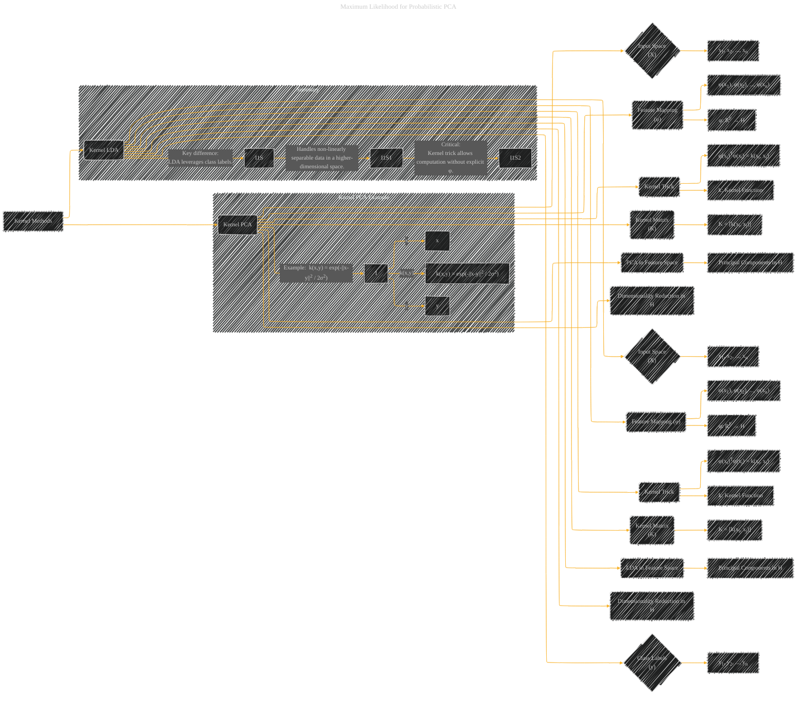

# Kernel PCA and Kernel LDA
> **Disclaimer:**
>
> This document contains my personal notes on the topic,
> compiled from publicly available documentation and various cited sources.
> The materials are intended for educational purposes, personal study, and reference.
> The content is dual-licensed:
> 1. **MIT License:** Applies to all code implementations (Swift, Mermaid, and other programming languages).
> 2. **Creative Commons Attribution 4.0 International License (CC BY 4.0):** Applies to all non-code content, including text, explanations, diagrams, and illustrations.
---

## Kernel PCA and Kernel LDA - A Diagram Structure

---

### Explanation

This diagram illustrates Kernel PCA and Kernel LDA, highlighting their shared structure and the crucial differences.

* **Kernel PCA:**  Starts with data in the input space (X).  A feature mapping (φ) transforms the data into a higher-dimensional feature space (H).  The kernel trick allows calculation of inner products in the feature space (φ(xi)Tφ(xj) = k(xi, xj)) without explicitly computing φ. A kernel matrix (K) is formed using these kernel values. Finally, the diagram depicts how standard PCA techniques are applied within the feature space to derive principal components for dimensionality reduction.

* **Kernel LDA:**  Similar to Kernel PCA, it begins with input data (X) and uses the feature mapping (φ) to transform into a higher-dimensional feature space (H).  The crucial difference lies in the incorporation of class labels (y). This aspect is explicitly called out in the summary subgraph, which emphasizes that Kernel LDA takes advantage of class labels for dimensionality reduction that works in non-linear spaces.  The kernel trick simplifies calculations, allowing dimensionality reduction without needing to explicitly know the feature mapping.

* **Key Difference:** The crucial difference between Kernel PCA and Kernel LDA is that Kernel LDA uses class labels to optimize the dimensionality reduction to be better suited for classification tasks. Kernel PCA only aims to maximize variance, whereas Kernel LDA aims to maximize class separation while minimizing within-class variance.

* **Summary:** The summary subgraph emphasizes the core concepts: the ability to handle non-linearly separable data by transforming to a higher-dimensional feature space and the use of the kernel trick to effectively perform computations within this space without explicit calculation of the feature mapping.

This diagram provides a structured and visual understanding of the key steps and differences between these two kernel methods. Remember to tailor the specific kernel functions (like the example Gaussian RBF kernel) and the types of data used to match the specific application you're visualizing.

---
**Licenses:**

- **MIT License:**   - Full text in [LICENSE](LICENSE) file.
- **Creative Commons Attribution 4.0 International:**  - Legal details in [LICENSE-CC-BY](LICENSE-CC-BY) and at [Creative Commons official site](http://creativecommons.org/licenses/by/4.0/).

---