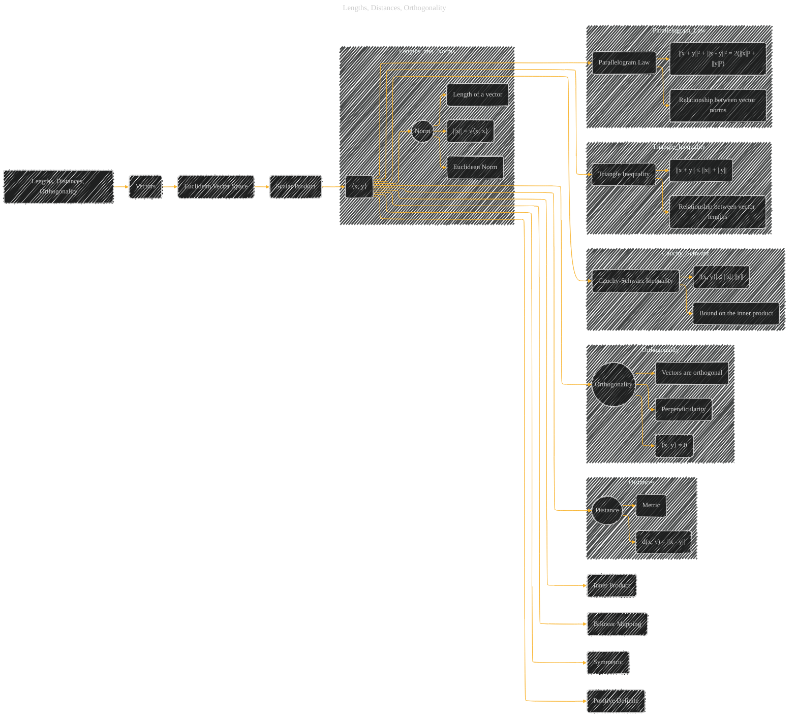

# Lengths, Distances, Orthogonality
> **Disclaimer:**
>
> This document contains my personal notes on the topic,
> compiled from publicly available documentation and various cited sources.
> The materials are intended for educational purposes, personal study, and reference.
> The content is dual-licensed:
> 1. **MIT License:** Applies to all code implementations (Swift, Mermaid, and other programming languages).
> 2. **Creative Commons Attribution 4.0 International License (CC BY 4.0):** Applies to all non-code content, including text, explanations, diagrams, and illustrations.
---

## A Diagram Structure

----

### Explanation

This Mermaid diagram visually represents the concepts of lengths, distances, and orthogonality within a Euclidean vector space.  Key elements are:

* **Euclidean Vector Space:**  The foundation is a vector space equipped with a scalar product (inner product).
* **Scalar Product (⟨x, y⟩):**  This is a fundamental operation that defines the relationship between vectors and produces a scalar value.  Crucially, the properties of bilinearity, symmetry, and positive-definiteness are emphasized.
* **Norm (||x||):** The norm (or length) of a vector is derived directly from the scalar product. The square root of the scalar product of a vector with itself gives the Euclidean norm.
* **Distance (d(x, y)):** The distance between two vectors is the norm of their difference.
* **Orthogonality (⟨x, y⟩ = 0):**  Two vectors are orthogonal if their scalar product is zero.  This represents perpendicularity.
* **Cauchy-Schwarz Inequality:**  This inequality provides a critical upper bound on the magnitude of the scalar product of two vectors.
* **Triangle Inequality:** This inequality expresses the relationship between the lengths of vectors and their sums.
* **Parallelogram Law:**  This law gives a geometric relationship between the norms of vectors and their sums.

The diagram emphasizes the connections between these concepts, showing how they're all built upon the foundational idea of a scalar product in a Euclidean vector space.  The inclusion of relevant equations (`⟨x, y⟩`, `||x||`, `d(x, y)`) within the diagram enhances its utility as a reference tool.

---
**Licenses:**

- **MIT License:**   - Full text in [LICENSE](LICENSE) file.
- **Creative Commons Attribution 4.0 International:**  - Legal details in [LICENSE-CC-BY](LICENSE-CC-BY) and at [Creative Commons official site](http://creativecommons.org/licenses/by/4.0/).

---