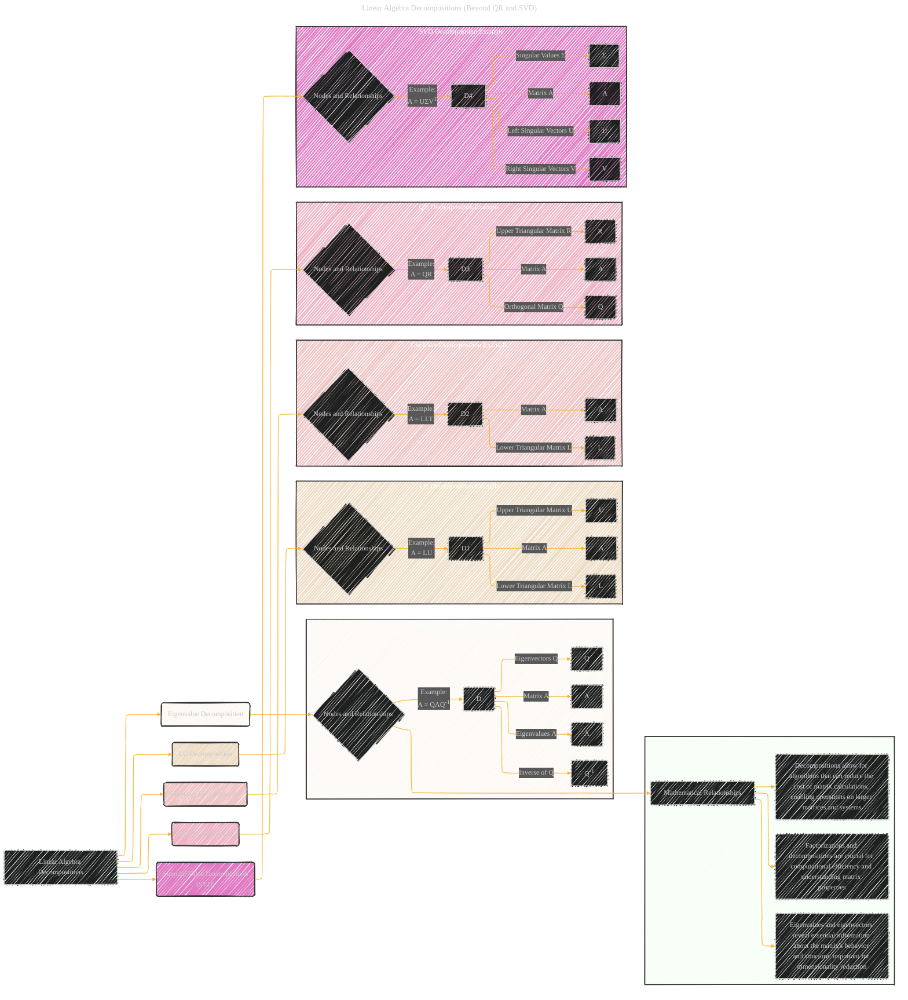

# Linear Algebra Decompositions
> **Disclaimer:**
>
> This document contains my personal notes on the topic,
> compiled from publicly available documentation and various cited sources.
> The materials are intended for educational purposes, personal study, and reference.
> The content is dual-licensed:
> 1. **MIT License:** Applies to all code implementations (Swift, Mermaid, and other programming languages).
> 2. **Creative Commons Attribution 4.0 International License (CC BY 4.0):** Applies to all non-code content, including text, explanations, diagrams, and illustrations.
---

## Linear Algebra Decompositions Overview

### Explanation and Considerations

This Mermaid diagram extends the structure to incorporate `Eigenvalue Decomposition`, `LU Decomposition`, `Cholesky Decomposition`, and a comprehensive summary.

* **Nodes:** Each decomposition method (`Eigenvalue`, `LU`, `Cholesky`, `QR`, `SVD`) is represented as a node, with sub-graphs illustrating specific examples.  Matrices (A, Q, Λ, L, U, Σ, R) are depicted as separate nodes, and the relationships between them are crucial.
* **Relationships:** Arrows (directed and undirected) connect the relevant nodes, illustrating how the various decompositions relate to one another and the original matrix.
* **Context:**  The summary subgraph emphasizes the *why* behind these decompositions.  It highlights their importance in computational efficiency, revealing matrix properties, and enabling more complex calculations.
* **Visual Clarity:** The color-coded subgraphs enhance readability and allow for quick identification of each decomposition method.

---
**Licenses:**

- **MIT License:**   - Full text in [LICENSE](LICENSE) file.
- **Creative Commons Attribution 4.0 International:**  - Legal details in [LICENSE-CC-BY](LICENSE-CC-BY) and at [Creative Commons official site](http://creativecommons.org/licenses/by/4.0/).

---