# Linear Discriminant Analysis
> **Disclaimer:**
>
> This document contains my personal notes on the topic,
> compiled from publicly available documentation and various cited sources.
> The materials are intended for educational purposes, personal study, and reference.
> The content is dual-licensed:
> 1. **MIT License:** Applies to all code implementations (Swift, Mermaid, and other programming languages).
> 2. **Creative Commons Attribution 4.0 International License (CC BY 4.0):** Applies to all non-code content, including text, explanations, diagrams, and illustrations.
---

## Linear Discriminant Analysis - A Diagram Structure

```mermaid
---
title: Linear Discriminant Analysis (LDA)
config:
  layout: elk
  look: handDrawn
  theme: dark
---
%%{
  init: {
    'fontFamily': 'verdana',
    'themeVariables': {
      'primaryColor': '#BB2528',
      'primaryTextColor': '#f529',
      'primaryBorderColor': '#7C0000',
      'lineColor': '#F8B229',
      'secondaryColor': '#006100',
      'tertiaryColor': '#fff'
    }
  }
}%%
graph LR
    A["Linear Discriminant Analysis<br>(LDA)"] --> B(Dimensionality Reduction)
    B --> C(Supervised Learning)
    C --> D(Feature Extraction)
    D --> E(Maximizing Between-Class Separability)

    subgraph LDA_Example["LDA Example"]
    E -- Example: Separating classes in feature space --> F
    F -- class 1 --> G[Class 1 Data Points]
    F -- class 2 --> H[Class 2 Data Points]
    F -- Separation --> I[LDA projection]
    I -- w --> J["Optimal Projection Vector<br>(w)"]
    
    E --> K(Minimizing Within-Class Variance)
    K --> L["Data within each class"]
    K --> M["Within-Class Scatter Matrix<br>(Sw)" ]
    K --> N["Minimize variance along w"]


    E --> O(Combining Criteria)
    O --> P["Between-Class Scatter Matrix<br>(Sb)"]
    O --> Q["Maximize distance between class means along w"]
    O --> R[Generalized Eigenvalue Problem]
    R --> S["Optimal projection vector<br>(w)"]
    S --> F

    subgraph Mathematical_Formulations["Mathematical Formulations"]
        S --> T[Optimization Problem]
        T -- Maximize tr(W<sup>T</sup>SbW) --> U
        U -- Subject to tr(W<sup>T</sup>SwW) = I --> V
        V -- Solution: --> W["Eigenvectors of S<sub>w</sub><sup>-1</sup>S<sub>b</sub>"]
        
        T --> X[Scatter Matrices]
        X -- S<sub>w</sub> = ∑<sub>j=1</sub><sup>C</sup> (1/N<sub>j</sub>) ∑<sub>xi∈Cj</sub> (x<sub>i</sub> - μ<sub>j</sub>)(x<sub>i</sub> - μ<sub>j</sub>)<sup>T</sup> --> Y
        X -- S<sub>b</sub> = ∑<sub>j=1</sub><sup>C</sup> N<sub>j</sub> (μ<sub>j</sub> - μ)(μ<sub>j</sub> - μ)<sup>T</sup> --> Z
        
    end
    
    subgraph LDA_Summary["LDA Summary"]
        F --> FA[Finding a transformation matrix W that maximizes the separation between class means while minimizing the variance within each class]
        FA --> FB[Data points projected onto new features]
        FB --> FC[Improved separability]
    end
end

```

---

### Explanation

* **LDA (Linear Discriminant Analysis):** This diagram depicts LDA as a dimensionality reduction technique that leverages labeled data to find the optimal projection for improved class separability.

* **Nodes and Relationships:** The graph shows the key components and their relationships. The nodes represent concepts (e.g., 'Within-Class Scatter Matrix'), and edges represent the relationships between those concepts (e.g., the use of scatter matrices to find the optimal projection vector).  The inclusion of equations like `tr(WTSbW)` and `tr(WTSwW) = I` clearly indicates the mathematical foundation.

* **Scatter Matrices (Sw, Sb):** The diagram correctly shows how these matrices are derived from the data, highlighting that Sw represents the within-class variance, and Sb represents the between-class variance.

* **Optimization Problem:** The diagram illustrates the central optimization problem that LDA solves—maximizing the separation between classes while minimizing the variance within each class.  The constraint `WTSwW = I` ensures that the transformation matrix W is orthogonal, which is often needed for stability in downstream tasks.

* **Solution:** LDA finds the optimal projection vector by computing the eigenvectors of Sw-1Sb. The eigenvectors corresponding to the largest eigenvalues are selected, and these define the new feature subspace.

* **Summary:** The subgraph 'LDA Summary' concisely summarizes the purpose and benefits of LDA.

This improved diagram provides a more comprehensive and semantically rich representation of LDA, incorporating mathematical details and the key steps of the algorithm.  It follows the structure of the provided example, emphasizing the optimization problem and the role of scatter matrices. Remember to replace placeholders like 'class 1' and 'class 2' with appropriate variable names when applying this diagram to a specific context.

---
**Licenses:**

- **MIT License:**   - Full text in [LICENSE](LICENSE) file.
- **Creative Commons Attribution 4.0 International:**  - Legal details in [LICENSE-CC-BY](LICENSE-CC-BY) and at [Creative Commons official site](http://creativecommons.org/licenses/by/4.0/).

---