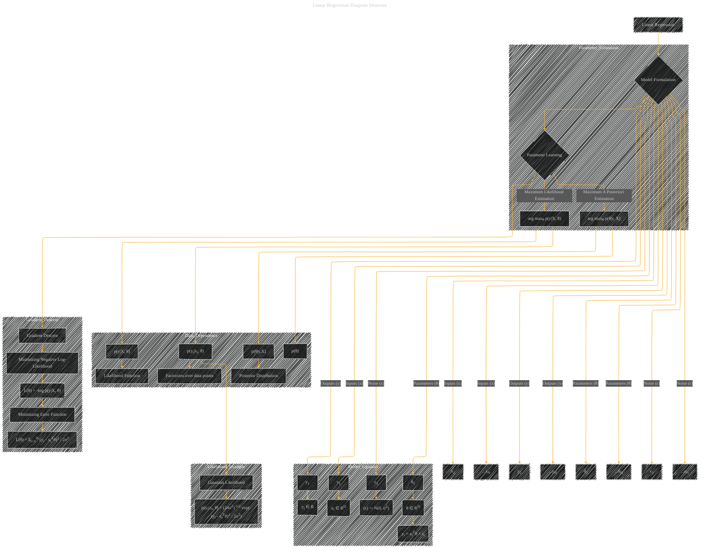

# Linear Regression
> **Disclaimer:**
>
> This document contains my personal notes on the topic,
> compiled from publicly available documentation and various cited sources.
> The materials are intended for educational purposes, personal study, and reference.
> The content is dual-licensed:
> 1. **MIT License:** Applies to all code implementations (Swift, Mermaid, and other programming languages).
> 2. **Creative Commons Attribution 4.0 International License (CC BY 4.0):** Applies to all non-code content, including text, explanations, diagrams, and illustrations.
---

## A Diagram Structure for Linear Regression

**Explanation:**

This Mermaid diagram visually represents the components of a linear regression model, its parameter estimation methods, and the mathematical underpinnings.  It connects the various elements (inputs, outputs, parameters, noise) and shows their relationships. The use of subgraphs enhances readability and organization. The equations are included for direct reference.

* **Nodes:**  Represent entities like variables, functions, and estimation methods.  The diagram includes nodes for inputs (xi), outputs (yi), parameters (θi), and the noise term (ϵi).
* **Edges:** Indicate relationships. For example, an edge connecting 'xi' to 'yi' represents the input-output relationship.
* **Subgraphs:** Organize related concepts, like the model equation, parameter estimation, or the likelihood example.
* **Equations:**  The diagram incorporates the essential equations of linear regression, including the model itself (yi = xiTθ + ϵi) and the likelihood function for a Gaussian noise model. This clarifies the mathematical basis of the model.

---
**Licenses:**

- **MIT License:**   - Full text in [LICENSE](LICENSE) file.
- **Creative Commons Attribution 4.0 International:**  - Legal details in [LICENSE-CC-BY](LICENSE-CC-BY) and at [Creative Commons official site](http://creativecommons.org/licenses/by/4.0/).

---