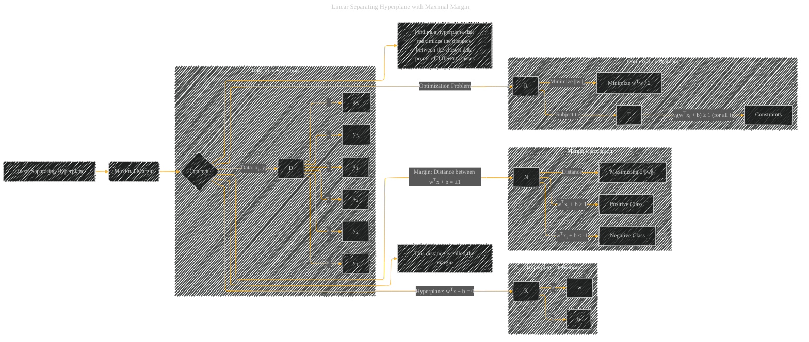

# Linear Separating Hyperplane with Maximal Margin
> **Disclaimer:**
>
> This document contains my personal notes on the topic,
> compiled from publicly available documentation and various cited sources.
> The materials are intended for educational purposes, personal study, and reference.
> The content is dual-licensed:
> 1. **MIT License:** Applies to all code implementations (Swift, Mermaid, and other programming languages).
> 2. **Creative Commons Attribution 4.0 International License (CC BY 4.0):** Applies to all non-code content, including text, explanations, diagrams, and illustrations.
---

## Linear Separating Hyperplane with Maximal Margin - A Diagram Structure

---

### Explanation

This Mermaid diagram visualizes the "Linear Separating Hyperplane with Maximal Margin" concept.

* **Nodes:**  Represent key elements like data points, the hyperplane, the margin, and the optimization problem.
* **Subgraphs:**  Organize related concepts, like data representation and the hyperplane definition.
* **Edges:**  Illustrate the relationships between concepts and the steps in finding the optimal hyperplane.

The diagram shows the core idea:  finding the hyperplane (`wTx + b = 0`) that maximizes the margin between the closest data points from different classes.  The margin is calculated as the distance between the planes `wTx + b = ±1`. The optimization problem is formally presented as minimizing the squared norm of `w` (a proxy for the margin) subject to the constraint that all data points are correctly classified, ensuring a maximum margin. This diagram directly reflects the mathematical and conceptual structure described in the original text.

---
**Licenses:**

- **MIT License:**   - Full text in [LICENSE](LICENSE) file.
- **Creative Commons Attribution 4.0 International:**  - Legal details in [LICENSE-CC-BY](LICENSE-CC-BY) and at [Creative Commons official site](http://creativecommons.org/licenses/by/4.0/).

---