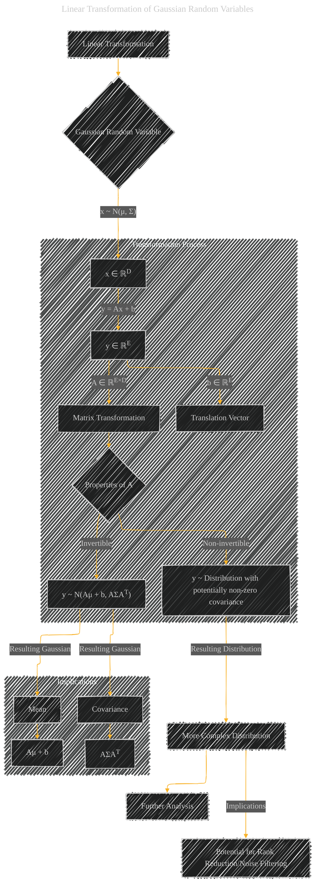

# Linear Transformation of Gaussian Random Variables
> **Disclaimer:**
>
> This document contains my personal notes on the topic,
> compiled from publicly available documentation and various cited sources.
> The materials are intended for educational purposes, personal study, and reference.
> The content is dual-licensed:
> 1. **MIT License:** Applies to all code implementations (Swift, Mermaid, and other programming languages).
> 2. **Creative Commons Attribution 4.0 International License (CC BY 4.0):** Applies to all non-code content, including text, explanations, diagrams, and illustrations.
---

## Linear Transformation of Gaussian Random Variables - A Diagram Structure

----

### Explanation

This diagram illustrates the linear transformation of a Gaussian random variable.

* **Gaussian Random Variable (B):**  A random variable `x` in `ℝD` is distributed according to a multivariate Gaussian distribution with mean vector `μ` and covariance matrix `Σ`.  This is represented by the node `x ~ N(μ, Σ)`.

* **Transformation (D):**  The variable `x` is linearly transformed into `y` using a matrix `A` and a translation vector `b`.  The transformation is shown as `y = Ax + b`.  Crucially, the diagram highlights both the matrix `A` and the vector `b` as distinct components of the transformation.

* **Matrix Transformation (E):** The role of the matrix `A` in performing the transformation is emphasized.  This is a critical step in understanding the effect of the transformation on the original distribution.

* **Translation Vector (F):**  The translation vector `b` is explicitly represented as contributing to the transformation.

* **Properties of A (G):**  The diagram distinguishes between the cases where the transformation matrix `A` is invertible and non-invertible.

    * **Invertible (H):** If `A` is invertible, the resulting transformed variable `y` also follows a Gaussian distribution, but with a transformed mean and covariance. The specific formula, `y ~ N(Aμ + b, AΣAT)`, is displayed.

    * **Non-invertible (I):** If `A` is non-invertible, the resulting distribution is more complex, with implications for potential rank reduction or noise filtering (as singular values may be lost or reduced), and potentially requiring further analysis.

* **Implications (H, I):** The resulting Gaussian distribution's mean (J) and covariance (K) are clearly derived from the original mean and covariance and the transformation matrix.

This diagram provides a structured overview of the process, highlighting the critical characteristics of the transformation matrix `A` and the resulting distribution of `y`.  It also makes clear the distinctions between invertible and non-invertible transformations and the implications of those distinctions.

---
**Licenses:**

- **MIT License:**   - Full text in [LICENSE](LICENSE) file.
- **Creative Commons Attribution 4.0 International:**  - Legal details in [LICENSE-CC-BY](LICENSE-CC-BY) and at [Creative Commons official site](http://creativecommons.org/licenses/by/4.0/).

---