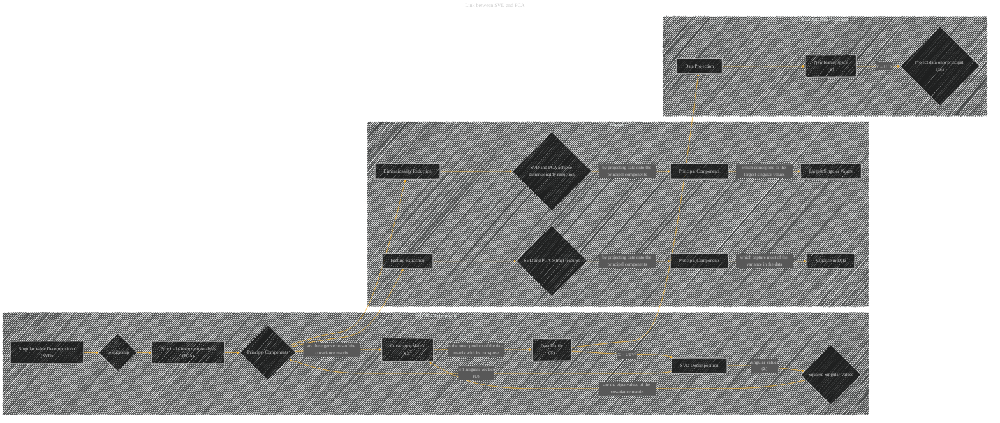

# Link between SVD and PCA
> **Disclaimer:**
>
> This document contains my personal notes on the topic,
> compiled from publicly available documentation and various cited sources.
> The materials are intended for educational purposes, personal study, and reference.
> The content is dual-licensed:
> 1. **MIT License:** Applies to all code implementations (Swift, Mermaid, and other programming languages).
> 2. **Creative Commons Attribution 4.0 International License (CC BY 4.0):** Applies to all non-code content, including text, explanations, diagrams, and illustrations.
---

## Link between SVD and PCA - A Diagram Structure

---

### Explaination

This diagram illustrates the relationship between SVD and PCA.  The core idea is that the principal components found by PCA are directly related to the singular vectors of the SVD of the data matrix.  The diagram highlights that the covariance matrix (XXT) is central to both, and how the SVD decomposition of the data matrix leads directly to the principal components and their corresponding eigenvalues.  Crucially, it also emphasizes how both methods achieve dimensionality reduction by projecting data onto these principal components. The example data projection part showcases how the projection actually works in practice.  Finally, the summary section captures the key takeaway of both techniques in terms of dimensionality reduction and feature extraction.

---
**Licenses:**

- **MIT License:**   - Full text in [LICENSE](LICENSE) file.
- **Creative Commons Attribution 4.0 International:**  - Legal details in [LICENSE-CC-BY](LICENSE-CC-BY) and at [Creative Commons official site](http://creativecommons.org/licenses/by/4.0/).

---