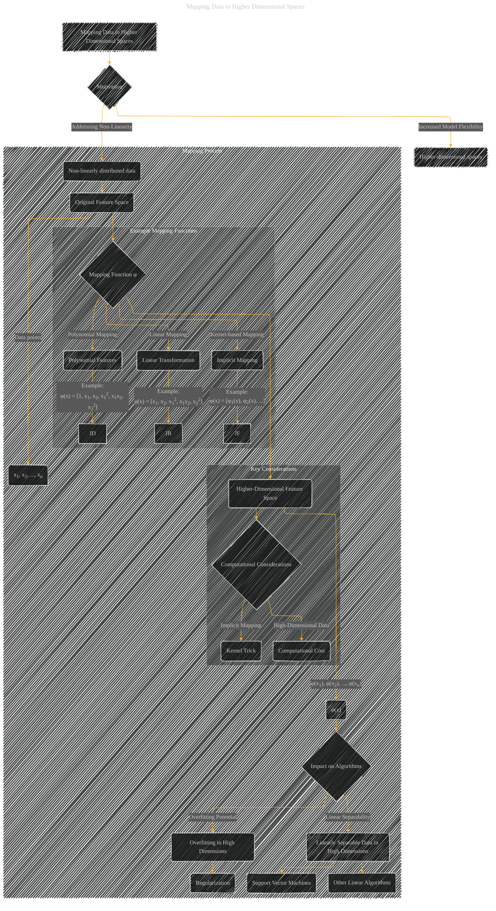

# Mapping Data to Higher Dimensional Spaces
> **Disclaimer:**
>
> This document contains my personal notes on the topic,
> compiled from publicly available documentation and various cited sources.
> The materials are intended for educational purposes, personal study, and reference.
> The content is dual-licensed:
> 1. **MIT License:** Applies to all code implementations (Swift, Mermaid, and other programming languages).
> 2. **Creative Commons Attribution 4.0 International License (CC BY 4.0):** Applies to all non-code content, including text, explanations, diagrams, and illustrations.
---

## Mapping Data to Higher Dimensional Spaces - A Diagram Structure

---

### Explanation of the Diagram

* **Mapping Data to Higher Dimensional Spaces (A):** This is the overarching topic.

* **Motivation (B):** The diagram highlights the two key motivations: addressing non-linear data and increasing model flexibility.

* **Original Feature Space (E):** Shows the initial data representation (e.g., in 2D or 3D).

* **Mapping Function (G):**  A crucial concept, the diagram illustrates the need for a mapping function (`φ`) to transform data points into a higher-dimensional feature space.

* **Higher-Dimensional Feature Space (H):** Visualizes the transformed data in the new, higher-dimensional space.  This emphasizes the increase in dimensionality.

* **Example Mapping Functions (subgraph):**  Provides concrete examples of how the mapping function can be implemented. The examples explicitly show linear and polynomial mapping techniques as well as the implicit kernel-based mapping (crucial to SVM).

* **Computational Considerations (subgraph):** This highlights the challenges associated with higher-dimensional spaces, particularly the potential increase in computational cost and the introduction of the kernel trick.

* **Impact on Algorithms (N):** This section clarifies the effects of mapping data to a higher dimensional space.

* **Support Vector Machines (Q), Other Linear Algorithms (R), Regularization (S):** These nodes represent the ways the higher-dimensional mapping impacts specific algorithms and techniques used to mitigate potential issues like overfitting.

---

### Key Improvements and Considerations

* **Specificity:**  The diagram is more specific by showing examples of mapping functions.
* **Computational Complexity:**  It explicitly calls out the kernel trick as a solution for the computational cost of working in higher-dimensional spaces.
* **Impact on Algorithms:**  The diagram highlights how the mapping affects the behavior of specific algorithms and the need for regularization.
* **Structure:** Using subgraphs improves readability and allows for more detailed explanations within specific sections of the diagram.

This improved diagram more accurately reflects the complexities of mapping data to higher dimensions, incorporating the crucial elements of computational efficiency and the implications for different algorithms. Remember to add specific mathematical details and equations where possible for a more comprehensive visualization.

---
**Licenses:**

- **MIT License:**   - Full text in [LICENSE](LICENSE) file.
- **Creative Commons Attribution 4.0 International:**  - Legal details in [LICENSE-CC-BY](LICENSE-CC-BY) and at [Creative Commons official site](http://creativecommons.org/licenses/by/4.0/).

---