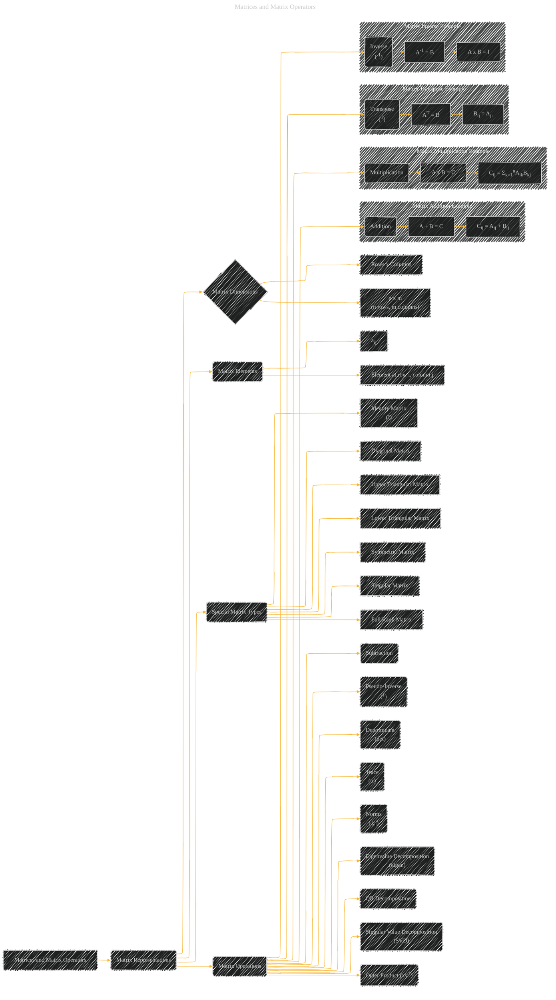

# Matrices and Matrix Operators
> **Disclaimer:**
>
> This document contains my personal notes on the topic,
> compiled from publicly available documentation and various cited sources.
> The materials are intended for educational purposes, personal study, and reference.
> The content is dual-licensed:
> 1. **MIT License:** Applies to all code implementations (Swift, Mermaid, and other programming languages).
> 2. **Creative Commons Attribution 4.0 International License (CC BY 4.0):** Applies to all non-code content, including text, explanations, diagrams, and illustrations.
---

## Matrices and Matrix Operators - A Diagram Structure

----

### Explanation

This Mermaid diagram outlines the key aspects of matrices and matrix operators.  It uses a hierarchical structure to represent the different concepts and provides example visualizations of key operations.  You can adapt this structure to represent more complex concepts or specific examples.  Crucially, it links operations to their fundamental definitions.

* **Matrix Representations:** Shows the fundamental way matrices are defined, including dimensions (rows x columns).

* **Special Matrix Types:** Identifies common matrix types important in linear algebra (Identity, Diagonal, Triangular, Symmetric, Singular, Full Rank).

* **Matrix Operations:** Highlights the operations that can be performed on matrices (addition, subtraction, multiplication, transpose, inverse, pseudo-inverse, determinant, trace, norms, eigenvalue decomposition, QR decomposition, SVD, outer product). Each operation is linked to its specific mathematical definition.

* **Example Visualizations:** The `subgraph` sections provide example visualizations of matrix addition, multiplication, and transpose operations, making the concepts more concrete. This is crucial for understanding the underlying mathematical operations.

---

### How to use this for further diagrams

*   **Specific Applications:**  To represent a particular application (like linear regression), you would replace the generic matrix elements with the specific variables relevant to that application (e.g., design matrix, feature vectors).
*   **Algorithm Steps:**  For an algorithm that involves matrix operations, you would use a flowchart-like structure to depict the sequence of matrix operations.
*   **Detailed Examples:** The example subgraphs can be expanded to showcase more complex examples.

This structured approach allows you to build visual representations that accurately reflect the mathematical concepts of matrix operations, making them easier to understand. Remember to always link back the visualizations to the underlying mathematical definitions.

---
**Licenses:**

- **MIT License:**   - Full text in [LICENSE](LICENSE) file.
- **Creative Commons Attribution 4.0 International:**  - Legal details in [LICENSE-CC-BY](LICENSE-CC-BY) and at [Creative Commons official site](http://creativecommons.org/licenses/by/4.0/).

---