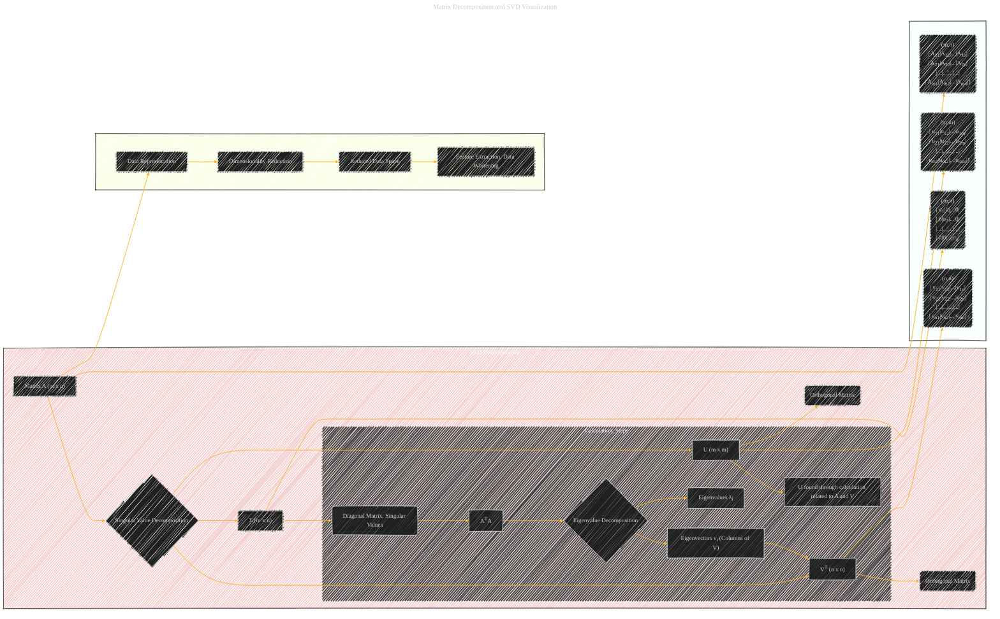

# Matrix Decomposition and SVD Visualization
> **Disclaimer:**
>
> This document contains my personal notes on the topic,
> compiled from publicly available documentation and various cited sources.
> The materials are intended for educational purposes, personal study, and reference.
> The content is dual-licensed:
> 1. **MIT License:** Applies to all code implementations (Swift, Mermaid, and other programming languages).
> 2. **Creative Commons Attribution 4.0 International License (CC BY 4.0):** Applies to all non-code content, including text, explanations, diagrams, and illustrations.
---

To apply the "Decomposition of Complex Concepts" strategy to matrix decomposition, we'll use the Singular Value Decomposition (SVD) as an example.  The SVD breaks down a matrix into a product of three matrices, revealing important information about the matrix's structure.  We'll decompose this complex process into smaller, more manageable steps.

## An Illustrative Example: Singular Value Decomposition (SVD)

### Diagram Types

* **Flowcharts:** Depict the sequence of calculations required for SVD.
* **Sequence Diagrams:**  Show the interactions between matrices and steps.
* **Matrices as Nodes:**  Represent each matrix (**A**, **U**, **Σ**, **VT**) as a node with labels showing its size and contents.

---

### UPDATE ME LATER

1. **Initial State:**  Start with a matrix **A** of size m x n.  Visualize this as a rectangular array of numbers.  Label it as matrix **A**.

2. **Orthogonal Matrices U and V:**  Visualize two orthogonal matrices, **U** (m x m) and **V** (n x n).  These are key to the decomposition, transforming the original space. Include a box indicating these matrices are orthonormal.

3. **Singular Values and Σ:**  Visualize a diagonal matrix **Σ** (m x n).  The entries on the diagonal are the singular values (σ1, σ2, ..., σp), arranged in descending order.  σ1 ≥ σ2 ≥ ... ≥ σp ≥ 0, where p = min(m, n).  Indicate that these singular values represent the importance of each dimension in the decomposition.

4. **SVD Equation:** Show the core equation of the SVD: **A** = **UΣVT**.  Include the individual matrices (**U**, **Σ**, **VT**) in the diagram, and show how they combine to form the original matrix **A**. This visual representation is essential.

5. **Calculation Steps (Optional):**  Depending on the context, you might want to show some of the calculation steps for finding the singular values and vectors. For example, illustrate how to compute **Σ**:

    *   **ATA:**  Show how the transpose of **A** (**AT**) is multiplied with the original matrix **A** to form the matrix **ATA**. Label this intermediate matrix.
    *   **Eigenvalue Decomposition:**  Illustrate how to find the eigenvalues and eigenvectors of **ATA**. Show how these are related to the singular values and vectors of the original matrix **A**. Include a node for the matrix whose eigenvalues are being computed.
    *   **Eigenvectors of ATA as Columns of V:** Show how the eigenvectors of **ATA** are the columns of the matrix **V**.
    *   **Singular Vectors from A and V:** Show how the singular vectors from **A** and **V** are connected to the eigenvalue decomposition and the diagonal matrix **Σ**.
    *   **Computation of U:**  Show how the left singular vectors (columns of **U**) can be computed. Show how U relates to A and V, showing a clear connection.

6. **Relationship to Data:**  Connect the decomposition to the original data.  If the matrix **A** represents data, the singular values and vectors can be used for dimensionality reduction.  Include a node for 'data' connected to A.  Visualize the transformation to a lower-dimensional space using the top k singular vectors.

---

### Explanation of the Mermaid Diagram

This diagram uses subgraphs to organize the different parts of the SVD process:

* **`SVD_Decomposition` subgraph:** Shows the overall structure of the SVD decomposition, with matrices A, U, Σ, and VT.  It highlights the relationships between the matrices.  The `Calculation_Steps` subgraph is nested here for a clearer view.

* **`Calculation_Steps` subgraph:**  This subgraph depicts the steps in finding the matrices U and Σ.  It starts from the transpose multiplication (ATA), then moves into the eigenvalue decomposition to derive eigenvectors (V), and finally calculates the singular vectors of U.

* **`Relationship_Data` subgraph:** Shows the connection between the matrix decomposition and its application to data, including dimensionality reduction and feature extraction.

* **`Example_Matrix_Nodes` subgraph:**  Illustrates specific examples of the matrices involved in the decomposition.  This example shows the structure of the matrices and their sizes (m x n).

### How it Applies Decomposition

The diagram effectively decomposes the complex SVD process into its constituent steps.  Each step is clearly labeled, and the relationships between the matrices are visually emphasized through the connections between nodes.  The use of subgraphs keeps related ideas organized. The example matrix nodes show the structure and entries, which is crucial for understanding the mathematical operations.

---
**Licenses:**

- **MIT License:**   - Full text in [LICENSE](LICENSE) file.
- **Creative Commons Attribution 4.0 International:**  - Legal details in [LICENSE-CC-BY](LICENSE-CC-BY) and at [Creative Commons official site](http://creativecommons.org/licenses/by/4.0/).

---