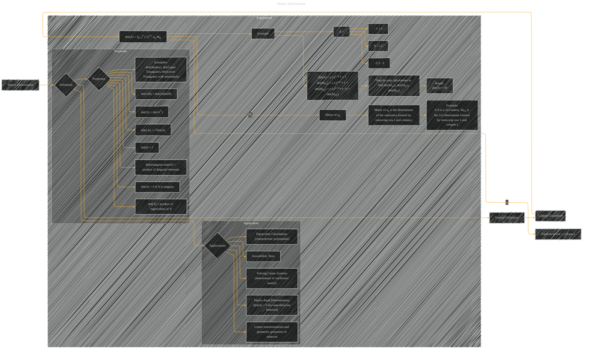

# Matrix Determinant
> **Disclaimer:**
>
> This document contains my personal notes on the topic,
> compiled from publicly available documentation and various cited sources.
> The materials are intended for educational purposes, personal study, and reference.
> The content is dual-licensed:
> 1. **MIT License:** Applies to all code implementations (Swift, Mermaid, and other programming languages).
> 2. **Creative Commons Attribution 4.0 International License (CC BY 4.0):** Applies to all non-code content, including text, explanations, diagrams, and illustrations.
---

## A Diagram Structure

----

### Explanation

This Mermaid graph visually outlines the definition and properties of a matrix determinant.  It uses a combination of nodes and subgraphs to organize the information logically.  The graph directly addresses the core concepts by:

*   **Defining the Determinant:** It starts with the definition of the determinant and uses Laplace expansion as the method for its calculation.
*   **Visualizing the Laplace Expansion:** The diagram shows the components of the Laplace expansion—the elements (aij) and their corresponding minors (Mij)—clearly.
*   **Providing an Example:**  A concrete example (a 3x3 matrix) with step-by-step calculations demonstrates the calculation process.
*   **Highlighting Properties:**  Subgraph 'Properties' clearly displays important properties of determinants, including their connection to invertibility, eigenvalues, and matrix rank.
*   **Emphasizing Applications:**  Subgraph 'Applications' connects the determinant to practical use cases in linear algebra and machine learning.

This structure allows for a comprehensive understanding of matrix determinants, their calculations, and their applications.  To use this diagram for other types of matrices, simply update the matrix elements and their minors in the example section. Remember to provide concrete numerical examples to make the illustration more informative.

---
**Licenses:**

- **MIT License:**   - Full text in [LICENSE](LICENSE) file.
- **Creative Commons Attribution 4.0 International:**  - Legal details in [LICENSE-CC-BY](LICENSE-CC-BY) and at [Creative Commons official site](http://creativecommons.org/licenses/by/4.0/).

---