# Matrix Inverse
> **Disclaimer:**
>
> This document contains my personal notes on the topic,
> compiled from publicly available documentation and various cited sources.
> The materials are intended for educational purposes, personal study, and reference.
> The content is dual-licensed:
> 1. **MIT License:** Applies to all code implementations (Swift, Mermaid, and other programming languages).
> 2. **Creative Commons Attribution 4.0 International License (CC BY 4.0):** Applies to all non-code content, including text, explanations, diagrams, and illustrations.
---

## A Diagram Structure

```mermaid
---
title: Matrix Inverse
config:
  layout: elk
  look: handDrawn
  theme: dark
---
%%{
  init: {
    'fontFamily': 'verdana',
    'themeVariables': {
      'primaryColor': '#BB2528',
      'primaryTextColor': '#f529',
      'primaryBorderColor': '#7C0000',
      'lineColor': '#F8B229',
      'secondaryColor': '#006100',
      'tertiaryColor': '#fff'
    }
  }
}%%
graph LR
    A[Matrix Inverse] --> B{Conditions for Invertability}
    B --> C(Non-Singular/Invertible)
    C --> CA[Determinant ≠ 0]
    C --> CB[Full Rank]
    C --> CC[Unique Solution to Ax = 0]
    
    subgraph Matrix_Inverse_Methods
        C --> D(Inverse Matrix)
        D --> DA(Closed-form Solutions)
        DA --> DAA["Gaussian Elimination<br>(e.g., using LU Decomposition)"]
        DA --> DAB["Adjoint Method<br>(using cofactors)"]

        D --> DB(Numerical Methods)
        DB --> DBA["Iterative Methods (e.g., Jacobi, Gauss-Seidel)"]
        DB --> DBB["Direct Factorization (e.g., LU, QR)"]
        DBB --> DBB1[LU Decomposition: Decompose matrix into lower and upper triangular matrices]
        DBB --> DBB2[QR Decomposition: Decompose into orthogonal and upper triangular matrices]
        DBB --> DBB3[Advantage for numerical stability, especially for ill-conditioned matrices]
    end

    B --> E(Singular/Non-invertible)
    E --> EA[Determinant = 0]
    E --> EB[Rank < n]
    E --> EC[No unique solution to Ax = 0]
    
    E --> F(Pseudoinverse)
    F --> FA[Generalization for non-square or rank-deficient matrices]
    F --> FB[Computed using Moore-Penrose inverse]

    subgraph Summary
        C --> C1[Mathematical Framework]
        C1 --> C1A[Invertible matrices are essential for solving systems of linear equations and for various transformations in linear algebra]
        C1 --> C1B[Singular matrices arise in practical scenarios, often indicating linearly dependent columns or a lack of unique solutions]

        E --> E1[Mathematical Framework]
        E1 --> E1A[Pseudoinverses provide a way to deal with these cases while minimizing loss of information]
        E1 --> E1B[Frequently used in least-squares problems and matrix decompositions, where unique inverses may not exist]
    end

```

----

### Explanation

* **Conditions for Invertability (B):**  This subgraph highlights the criteria for a matrix to be invertible.  It explicitly connects non-singular matrices to the existence of an inverse.
* **Inverse Matrix Methods (D):** This subgraph distinguishes between closed-form and numerical methods for computing inverses.  It provides examples of common techniques, such as Gaussian elimination (and its variants like LU decomposition) and the adjoint method.  It also points out the advantages of numerical methods for numerical stability.
* **Singular/Non-invertible Matrices (E):** This subgraph illustrates the situation where a matrix is not invertible, often due to linearly dependent columns or a zero determinant.  It emphasizes the concept of the pseudoinverse as a generalization for such matrices.
* **Summary:**  This subgraph provides a high-level overview of the significance of matrix inverses in linear algebra and machine learning.  It highlights that the pseudoinverse provides a practical approach for handling situations where a unique inverse doesn't exist.

----

### Important Considerations

* **Illustrative Examples:**  The diagrams could be enhanced with examples of 2x2 or 3x3 matrices to show how these methods work.  For example, include a matrix and its inverse in a subgraph of the "Closed-form Solutions" section.
* **Contextual Links:**  Consider adding connections to relevant areas in the larger document, such as linear equation solving, matrix decompositions (LU, QR, SVD), or the application of matrix inverses in machine learning algorithms.  For example, you could link from "Gaussian Elimination" to a section of the document that discusses solving linear systems.
* **Numerical Stability:**  The diagram should emphasize the importance of numerical stability in matrix inversion, especially when dealing with ill-conditioned matrices.  Highlight the advantages of numerical methods like LU and QR decomposition for this.
* **Computational Complexity:**  You could add annotations to show the computational complexity of each method (e.g., O(n3) for Gaussian elimination, where n is the matrix size).

This enhanced Mermaid structure will provide a more comprehensive and nuanced view of matrix inversion, its conditions, and methods. Remember to use this as a framework and adapt it with specific examples and details from the original document.

---
**Licenses:**

- **MIT License:**   - Full text in [LICENSE](LICENSE) file.
- **Creative Commons Attribution 4.0 International:**  - Legal details in [LICENSE-CC-BY](LICENSE-CC-BY) and at [Creative Commons official site](http://creativecommons.org/licenses/by/4.0/).

---