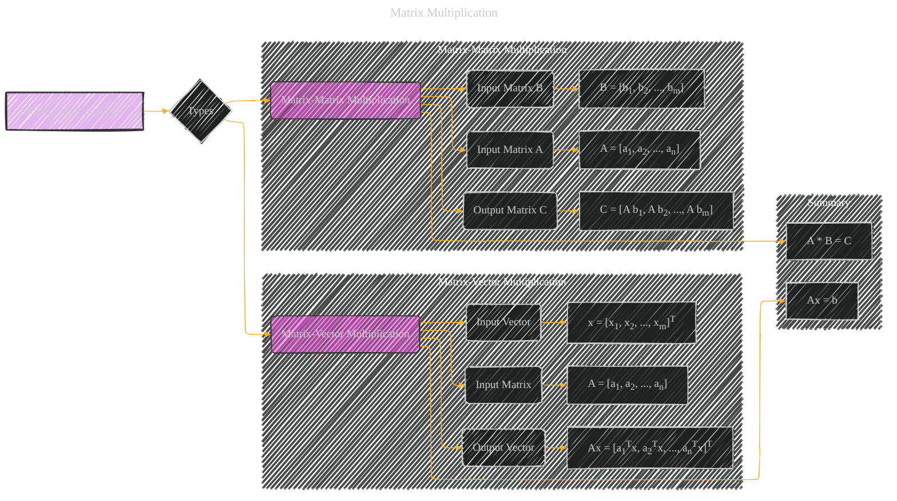

# Matrix Multiplications
> **Disclaimer:**
>
> This document contains my personal notes on the topic,
> compiled from publicly available documentation and various cited sources.
> The materials are intended for educational purposes, personal study, and reference.
> The content is dual-licensed:
> 1. **MIT License:** Applies to all code implementations (Swift, Mermaid, and other programming languages).
> 2. **Creative Commons Attribution 4.0 International License (CC BY 4.0):** Applies to all non-code content, including text, explanations, diagrams, and illustrations.
---

## Matrix Multiplications - A Diagram Structure

----

### Explanation

The Mermaid diagram illustrates two key types of matrix multiplications: matrix-vector and matrix-matrix.

* **Matrix-Vector Multiplication (Ax = b):**
    * **Input Matrix (A):**  Represented as a collection of column vectors (a1, a2, ..., an).
    * **Input Vector (x):** A column vector of appropriate dimensions ([x1, x2, ..., xm]T) for the multiplication to be valid.
    * **Output Vector (b):**  The result of the multiplication, a column vector where each element is a dot product of a row of A with x ([a1Tx, a2Tx, ..., anTx]T).  This illustrates the core operation: computing the linear combination of columns of A using components of x.

* **Matrix-Matrix Multiplication (A * B = C):**
    * **Input Matrix A:**  Again, represented as a collection of column vectors ([a1, a2, ..., an]).
    * **Input Matrix B:**  A matrix of appropriate dimensions for multiplication ([b1, b2, ..., bm])
    * **Output Matrix C:** The result of the multiplication, a matrix where each column is a matrix-vector multiplication of A with a column vector of B ([A b1, A b2, ..., A bm]). This depicts the key concept of computing a linear combination of columns of B using rows of A to produce each column of C.

* **Summary subgraph:**  The summary subgraph visually connects the two types of multiplications to the equations that represent them (`Ax = b` for matrix-vector and `A * B = C` for matrix-matrix).  It further describes the fundamental operations involved in each type, highlighting the computation as a linear combination of column vectors for matrix-vector multiplication and of column vectors of B using rows of A for matrix-matrix multiplication.

This structured diagram effectively captures the core concepts of matrix multiplication, their types, and the underlying calculations.  It's ready to be adapted to more specific use cases if required. Remember to replace the example vector and matrix values with the actual values you want to visualize.

---
**Licenses:**

- **MIT License:**   - Full text in [LICENSE](LICENSE) file.
- **Creative Commons Attribution 4.0 International:**  - Legal details in [LICENSE-CC-BY](LICENSE-CC-BY) and at [Creative Commons official site](http://creativecommons.org/licenses/by/4.0/).

---