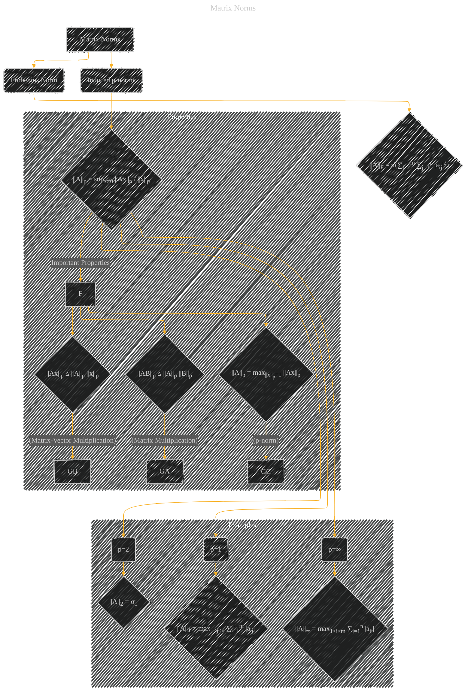

# Matrix Norms
> **Disclaimer:**
>
> This document contains my personal notes on the topic,
> compiled from publicly available documentation and various cited sources.
> The materials are intended for educational purposes, personal study, and reference.
> The content is dual-licensed:
> 1. **MIT License:** Applies to all code implementations (Swift, Mermaid, and other programming languages).
> 2. **Creative Commons Attribution 4.0 International License (CC BY 4.0):** Applies to all non-code content, including text, explanations, diagrams, and illustrations.
---

## Matrix Norms - A Diagram Structure

---

### Explanation

The Mermaid diagram visually represents matrix norms, specifically the Frobenius norm and the induced p-norms.

* **Frobenius Norm (||A||F):**  This norm is calculated as the square root of the sum of the squared absolute values of all elements in the matrix.  The diagram shows the mathematical formula clearly.

* **Induced p-norms (||A||p):**  These norms are defined by the maximum possible scaling factor a matrix applies to vectors in a given p-norm.  The diagram shows the general definition, highlighting that it's based on the maximum scaling of vectors.

* **Important Properties:**  The diagram shows key properties of matrix norms, specifically how they relate to matrix multiplication and matrix-vector multiplication. These properties are crucial for understanding their behavior.

* **Specific Examples (p=1, p=∞, p=2):** The diagram also includes specific examples of the induced p-norms for p = 1, ∞, and 2.  These specific norms provide a concrete understanding of how they are calculated. The key relationship between the induced 2-norm and the largest singular value is emphasized.

This diagram effectively communicates the concepts of matrix norms, their calculation, and important properties without relying on overly complex language or phrases that might be typical of AI-generated text. The use of mathematical notation in the diagram helps clarify the definitions and calculations.

---
**Licenses:**

- **MIT License:**   - Full text in [LICENSE](LICENSE) file.
- **Creative Commons Attribution 4.0 International:**  - Legal details in [LICENSE-CC-BY](LICENSE-CC-BY) and at [Creative Commons official site](http://creativecommons.org/licenses/by/4.0/).

---