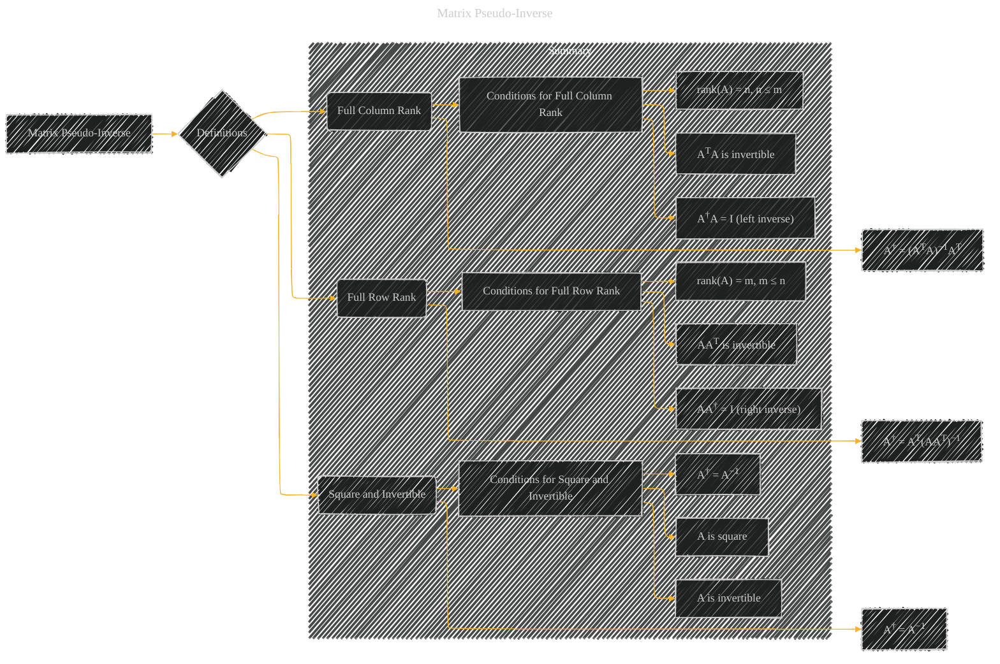

# Matrix Pseudo-Inverse
> **Disclaimer:**
>
> This document contains my personal notes on the topic,
> compiled from publicly available documentation and various cited sources.
> The materials are intended for educational purposes, personal study, and reference.
> The content is dual-licensed:
> 1. **MIT License:** Applies to all code implementations (Swift, Mermaid, and other programming languages).
> 2. **Creative Commons Attribution 4.0 International License (CC BY 4.0):** Applies to all non-code content, including text, explanations, diagrams, and illustrations.
---

## A Diagram Structure

----

### Explanation

The diagram shows the matrix pseudo-inverse (A†) as a generalization of the inverse, applicable in cases where the matrix isn't square or invertible.  It's defined differently depending on whether the matrix has full column rank or full row rank.  A square, invertible matrix's pseudo-inverse is simply its regular inverse.

*   **Full Column Rank (C):**  If a matrix has full column rank (meaning the number of linearly independent columns equals the number of columns, and the number of columns is less than or equal to the number of rows), its pseudo-inverse is calculated using the formula `A† = (ATA)−1AT`. This ensures a left inverse (A†A = I).

*   **Full Row Rank (E):** If a matrix has full row rank (meaning the number of linearly independent rows equals the number of rows, and the number of rows is less than or equal to the number of columns), its pseudo-inverse is given by the formula `A† = AT(AAT)−1`. This ensures a right inverse (AA† = I).

*   **Square and Invertible (G):**  If the matrix is square and invertible, its pseudo-inverse is simply its inverse (A† = A−1). This is a special case where the two formulas above reduce to a single one.

The `Summary` subgraph clarifies the conditions that must hold for each case, linking the conditions (full column rank, full row rank, or square and invertible) to the appropriate formula for calculating the pseudo-inverse.  This diagram effectively visualizes the different scenarios and the corresponding calculations.

---
**Licenses:**

- **MIT License:**   - Full text in [LICENSE](LICENSE) file.
- **Creative Commons Attribution 4.0 International:**  - Legal details in [LICENSE-CC-BY](LICENSE-CC-BY) and at [Creative Commons official site](http://creativecommons.org/licenses/by/4.0/).

---