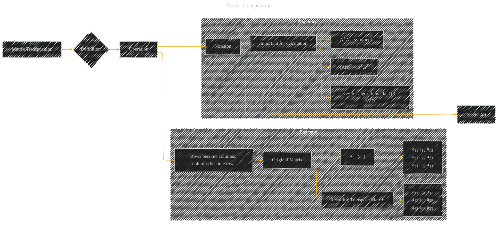

# Matrix Transposition
> **Disclaimer:**
>
> This document contains my personal notes on the topic,
> compiled from publicly available documentation and various cited sources.
> The materials are intended for educational purposes, personal study, and reference.
> The content is dual-licensed:
> 1. **MIT License:** Applies to all code implementations (Swift, Mermaid, and other programming languages).
> 2. **Creative Commons Attribution 4.0 International License (CC BY 4.0):** Applies to all non-code content, including text, explanations, diagrams, and illustrations.
---

## A Diagram Structure

----

### Explanation

The diagram uses a combination of shapes and annotations to clearly define matrix transposition.

*   **A[Matrix Transposition]:** The main topic.
*   **B{Definition}:** Highlighting the core definition.
*   **C[Operation]:** Emphasizing the action performed.
*   **D[Rows become columns, columns become rows]:**  A concise description of the transposition process.
*   **Example subgraph:** This visually demonstrates the transformation.  It shows the original matrix and the resultant transposed matrix with clear notation for the elements (e.g., a11, a22). This is a crucial part for understanding the concept.
*   **E[Notation]:** Shows how the transpose is denoted mathematically.
*   **Properties subgraph:** This illustrates the importance of transposition for calculations. The properties listed demonstrate how transposition affects matrix operations and why it's useful in algorithms.

This diagram effectively summarizes the concept of matrix transposition using a visual representation that incorporates the core definition, a clear example, and important mathematical notation. It also highlights why the concept is essential in various linear algebra applications. Remember that these diagrams are adaptable to other matrix sizes (3x3 or n x m) as needed.

---
**Licenses:**

- **MIT License:**   - Full text in [LICENSE](LICENSE) file.
- **Creative Commons Attribution 4.0 International:**  - Legal details in [LICENSE-CC-BY](LICENSE-CC-BY) and at [Creative Commons official site](http://creativecommons.org/licenses/by/4.0/).

---