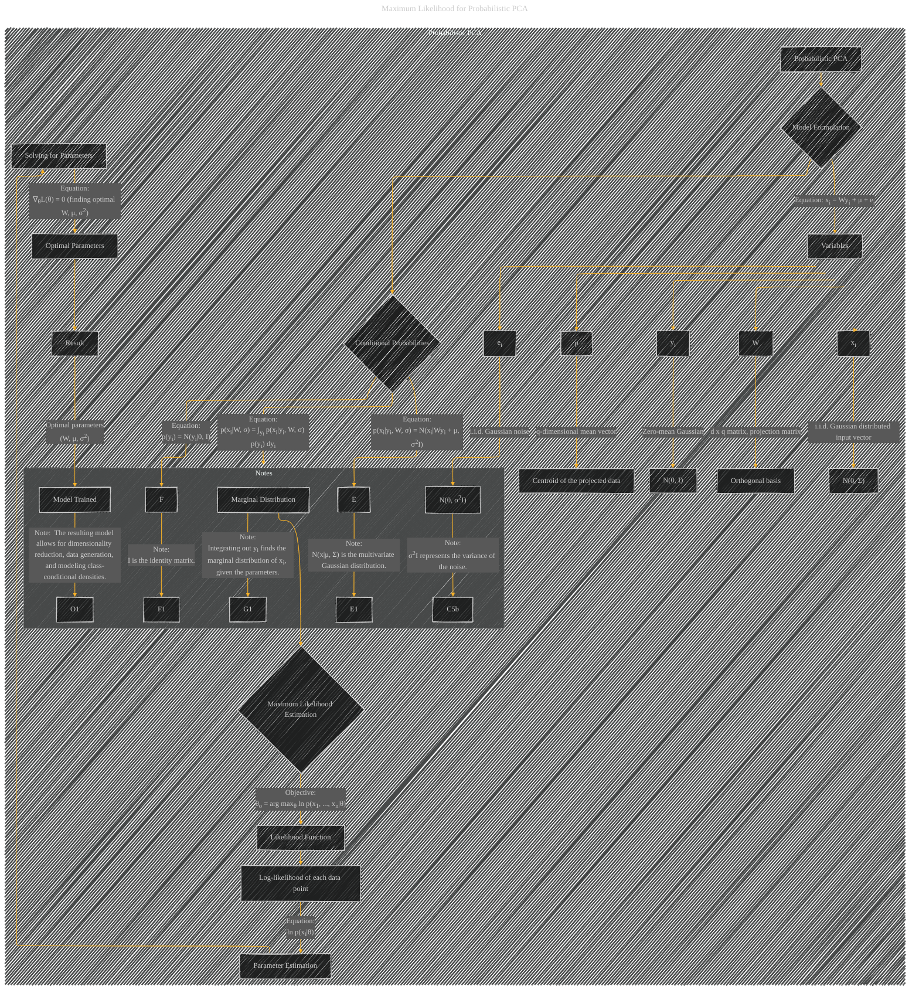

# Maximum Likelihood for Probabilistic PCA
> **Disclaimer:**
>
> This document contains my personal notes on the topic,
> compiled from publicly available documentation and various cited sources.
> The materials are intended for educational purposes, personal study, and reference.
> The content is dual-licensed:
> 1. **MIT License:** Applies to all code implementations (Swift, Mermaid, and other programming languages).
> 2. **Creative Commons Attribution 4.0 International License (CC BY 4.0):** Applies to all non-code content, including text, explanations, diagrams, and illustrations.
---

## Maximum Likelihood for Probabilistic PCA - A Diagram Structure

---

### Explanation of the Diagram

* **Subgraph `Probabilistic PCA`:** This encapsulates the entire Probabilistic PCA model.
* **Node `A`:**  The overall Probabilistic PCA model.
* **Node `C` and connected nodes:**  Define the variables involved in the PPCA model.  The links illustrate the distributions they follow and their role in the model.
* **Node `B`:**  Showcases the core equation and how it relates to the variables.
* **Node `D`:** Shows the conditional and marginal distributions in mathematical equations.
* **Node `G`:** Showcases the mathematical equation of the marginal distribution.
* **Node `H`:**  Defines the core goal of the Maximum Likelihood Estimation.
* **Node `I`:** Shows the likelihood function of the PPCA model.
* **Node `J`:** Shows the log-likelihood function of the PPCA model.
* **Node `K`:** Shows how the optimal parameters are estimated from the likelihood function.
* **Node `L`:** Shows how the parameters are solved using differentiation.
* **Node `M`:** Shows the final results.
* **Subgraph `Notes`:** This provides crucial explanations for the notation and mathematical concepts used in the model.  The notes are essential for understanding the meaning of the nodes and edges.

This diagram provides a visual representation of the Probabilistic PCA model and the associated maximum likelihood estimation process, aligning with the structure suggested in the previous response. Remember to fill in specific equations and variable names as appropriate for your specific use case.

---
**Licenses:**

- **MIT License:**   - Full text in [LICENSE](LICENSE) file.
- **Creative Commons Attribution 4.0 International:**  - Legal details in [LICENSE-CC-BY](LICENSE-CC-BY) and at [Creative Commons official site](http://creativecommons.org/licenses/by/4.0/).

---