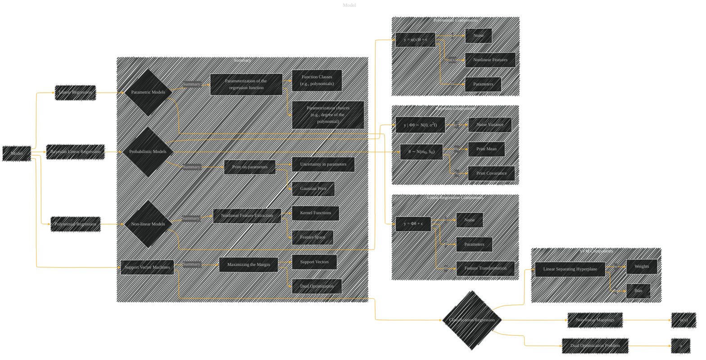

# Model
> **Disclaimer:**
>
> This document contains my personal notes on the topic,
> compiled from publicly available documentation and various cited sources.
> The materials are intended for educational purposes, personal study, and reference.
> The content is dual-licensed:
> 1. **MIT License:** Applies to all code implementations (Swift, Mermaid, and other programming languages).
> 2. **Creative Commons Attribution 4.0 International License (CC BY 4.0):** Applies to all non-code content, including text, explanations, diagrams, and illustrations.
---

## Model - A Diagram Structure

---

### Explanation

This diagram provides a structured overview of different models, categorizing them by their core characteristics.  Each model is represented by a node, and subgraphs detail the key components within each model type.  The diagram is adaptable, allowing you to add more details or specific aspects of each model.  It uses a consistent visual language to represent models and their components.  Importantly, the diagram highlights the relationship between linear and non-linear models.

---
**Licenses:**

- **MIT License:**   - Full text in [LICENSE](LICENSE) file.
- **Creative Commons Attribution 4.0 International:**  - Legal details in [LICENSE-CC-BY](LICENSE-CC-BY) and at [Creative Commons official site](http://creativecommons.org/licenses/by/4.0/).

---