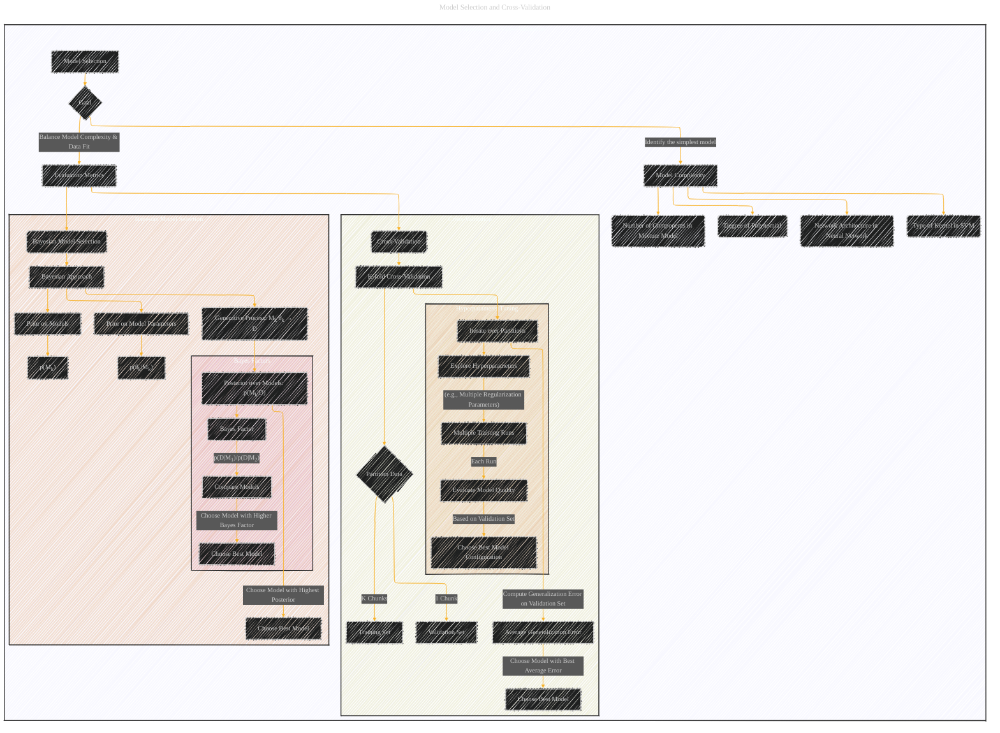

# Model Selection and Cross-Validation
> **Disclaimer:**
>
> This document contains my personal notes on the topic,
> compiled from publicly available documentation and various cited sources.
> The materials are intended for educational purposes, personal study, and reference.
> The content is dual-licensed:
> 1. **MIT License:** Applies to all code implementations (Swift, Mermaid, and other programming languages).
> 2. **Creative Commons Attribution 4.0 International License (CC BY 4.0):** Applies to all non-code content, including text, explanations, diagrams, and illustrations.
---

## A Diagram Structure

DOI: [10.13140/RG.2.2.33627.89125](http://dx.doi.org/10.13140/RG.2.2.33627.89125)

---

### Explanation

* **Model Selection:**  The overarching goal is to find the simplest model that effectively explains the data.  This involves considering model complexity, including factors like the polynomial degree, mixture model components, or the network architecture in a neural network.

* **Evaluation Metrics:** This involves methods for assessing how well a model generalizes to unseen data, which are crucial for model selection.  Two key methods are highlighted:

    * **Cross-Validation:**  A process that partitions the dataset into multiple subsets.  One subset is used as a validation set, while the rest is used for training.  This process is repeated for all possible partitions, and the model with the best average performance across all iterations is selected.  The diagram includes a subgraph for hyperparameter tuning, illustrating the common practice of exploring various model configurations during cross-validation.

    * **Bayesian Model Selection:**  This approach uses Bayesian probabilities to quantify the plausibility of different models. A prior is assigned to each model, along with priors on the model's parameters. The posterior probability of each model given the data is calculated, and the model with the highest posterior probability is selected. A subgraph is included to emphasize the use of Bayes factors for model comparison.

* **Hierarchical Structure:**  The diagram uses subgraphs to illustrate the hierarchical nature of these processes.  This visual clarity helps to understand the steps involved and their relationships.

---
**Licenses:**

- **MIT License:**   - Full text in [LICENSE](LICENSE) file.
- **Creative Commons Attribution 4.0 International:**  - Legal details in [LICENSE-CC-BY](LICENSE-CC-BY) and at [Creative Commons official site](http://creativecommons.org/licenses/by/4.0/).

---