# Multi-class Case
> **Disclaimer:**
>
> This document contains my personal notes on the topic,
> compiled from publicly available documentation and various cited sources.
> The materials are intended for educational purposes, personal study, and reference.
> The content is dual-licensed:
> 1. **MIT License:** Applies to all code implementations (Swift, Mermaid, and other programming languages).
> 2. **Creative Commons Attribution 4.0 International License (CC BY 4.0):** Applies to all non-code content, including text, explanations, diagrams, and illustrations.
---

## Multi-class Case - A Diagram Structure

```mermaid
---
title: Multi-class Case
config:
  layout: elk
  look: handDrawn
  theme: dark
---
%%{
  init: {
    'fontFamily': 'verdana',
    'themeVariables': {
      'primaryColor': '#BB2528',
      'primaryTextColor': '#f529',
      'primaryBorderColor': '#7C0000',
      'lineColor': '#F8B229',
      'secondaryColor': '#006100',
      'tertiaryColor': '#fff'
    }
  }
}%%
graph LR
    subgraph Multi_class_LDA["Multi-class LDA"]
        A[Multi-class LDA] --> B{Goal}
        B -- Find a projection W --> C[Project data]
        C -- Maximize separability --> D{Within-Class Variance Minimization}
        D -- Minimize variance within each class --> E[S<sub>w</sub>]
        D -- Maximize variance between classes --> F[S<sub>b</sub>]
        E -- Sum of within-class scatter matrices --> G[S<sub>w</sub> = Σ<sub>j=1</sub><sup>C</sup> S<sub>j</sub>];
        F -- Between-class scatter matrix --> H["S<sub>b</sub> = Σ<sub>j=1</sub><sup>C</sup> N<sub>c<sub>j</sub></sub> (µ<sub>c<sub>j</sub></sub> − µ)(µ<sub>c<sub>j</sub></sub> − µ)<sup>T</sup>"]
        G -- Each S<sub>j</sub> is the scatter matrix for class c<sub>j</sub> --> I["S<sub>j</sub> = (1/N<sub>c<sub>j</sub></sub>)Σ<sub>x∈c<sub>j</sub></sub>(x − µ<sub>c<sub>j</sub></sub>)(x − µ<sub>c<sub>j</sub></sub>)<sup>T</sup>"]
        H -- µ is the overall mean --> J["µ = (1/N)Σ<sub>j=1</sub><sup>C</sup>Σ<sub>x∈c<sub>j</sub></sub> x"];

        G --> K[Maximize Separability]
        F --> K
        K -- "Maximize (tr(W<sup>T</sup> S<sub>b</sub>W)) / (tr(W<sup>T</sup> S<sub>w</sub>W))" --> L["W<sup>*</sup> = arg max<sub>W</sub> tr(W<sup>T</sup> S<sub>b</sub>W) s.t. W<sup>T</sup> S<sub>w</sub>W = I"]
        L -- "W is the projection matrix" --> M["W = [w<sub>1</sub>, ..., w<sub>d</sub>]"]
        
        subgraph Summary["Summary"]
            M --> MM[W finds the d eigenvectors corresponding to the largest eigenvalues of S<sub>w</sub><sup>-1</sup>S<sub>b</sub>]
            MM --  d ≤ C − 1 --> MMM[d is the number of dimensions to project into]
        end
    end
    
```

----

### Explanation

* **Goal (B):**  The primary objective of multi-class LDA is to find a projection matrix (W) that maximizes the separability of different classes in a reduced-dimensional space.  This is achieved by minimizing the variance within each class and maximizing the variance between classes.

* **Within-Class Variance Minimization (D) and Sw (G):**  The goal is to project data points within each class as close as possible to their respective class means.  The within-class scatter matrix (Sw) encapsulates this;  it's a sum of the scatter matrices for each class (Sj).  Each Sj is calculated as the average of the squared deviations from the mean of each class.

* **Maximize Variance Between Classes (F) and Sb (H):**  LDA wants to spread the class means as far apart as possible in the reduced-dimensional space. This is captured by the between-class scatter matrix (Sb).  Sb calculates the variance between the class means, weighted by the number of data points in each class.

* **Maximize Separability (K):** The crucial objective is to maximize the ratio of the between-class scatter to the within-class scatter. The optimal projection matrix (W*) achieves this.  The equation in `L` precisely defines this maximization process.

* **Solution (L):** The optimal projection matrix (W*) is found by solving the generalized eigenvalue problem, where the columns of W are the eigenvectors of Sw-1Sb corresponding to the largest eigenvalues.  The number of dimensions (d) to project into is limited by the number of classes (C).

----

### Important Considerations

* **Mean (J):** The overall mean (µ) is a critical component for calculating the between-class scatter matrix.

* **Eigenvectors and Eigenvalues:** The solution to the maximization problem involves finding eigenvectors and eigenvalues of a specific matrix. This process is not explicitly shown in the diagram, but is crucial.

* **Reduced Dimensionality (MMM):**  The number of dimensions (d) to project to is crucial; it can't be greater than C-1.  This is because LDA aims to extract only the directions that maximize class separability.

This diagram effectively summarizes the process of multi-class LDA, highlighting the key concepts, equations, and the constraints on the solution.  It's important to remember that calculating the actual projection matrix (W) would involve numerical computation.

---
**Licenses:**

- **MIT License:**   - Full text in [LICENSE](LICENSE) file.
- **Creative Commons Attribution 4.0 International:**  - Legal details in [LICENSE-CC-BY](LICENSE-CC-BY) and at [Creative Commons official site](http://creativecommons.org/licenses/by/4.0/).

---