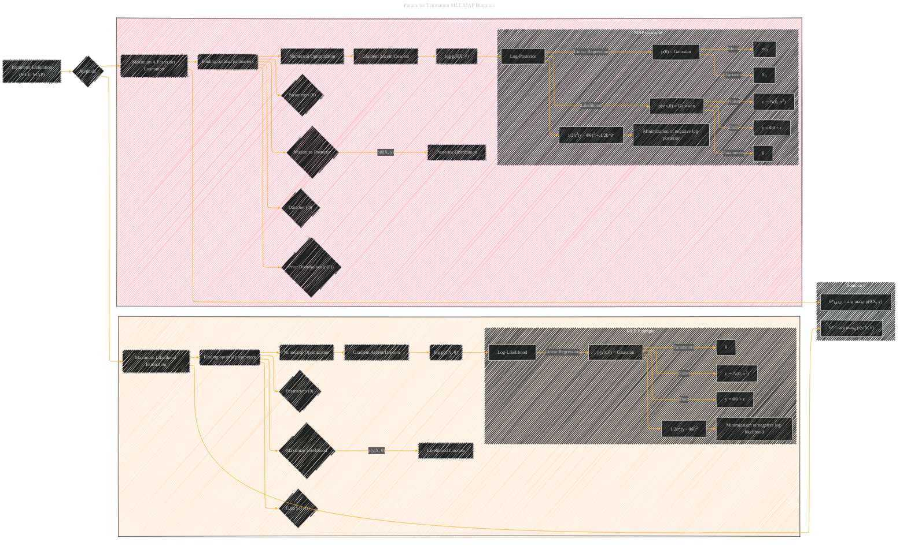

# Parameter Estimation MLE MAP Diagram
> **Disclaimer:**
>
> This document contains my personal notes on the topic,
> compiled from publicly available documentation and various cited sources.
> The materials are intended for educational purposes, personal study, and reference.
> The content is dual-licensed:
> 1. **MIT License:** Applies to all code implementations (Swift, Mermaid, and other programming languages).
> 2. **Creative Commons Attribution 4.0 International License (CC BY 4.0):** Applies to all non-code content, including text, explanations, diagrams, and illustrations.
---

## A Diagram Structure

**Explanation:**

This Mermaid diagram provides a more structured and detailed view of parameter estimation using MLE and MAP.  It incorporates the following key elements:

* **MLE (Maximum Likelihood Estimation):**  Focuses on maximizing the likelihood of the observed data given the parameters.  It includes a subgraph detailing how this works in the context of linear regression with Gaussian noise.  Includes a key equation summarizing the process.
* **MAP (Maximum A Posteriori Estimation):**  Emphasizes maximizing the posterior distribution, which considers both the likelihood of the data and a prior distribution on the parameters.  A dedicated subgraph illustrates the MAP process for linear regression with a Gaussian prior.  Includes a key equation.
* **Data and Parameters:** Clear representation of the data set (D) and the parameters (θ) as crucial inputs for both methods.
* **Numerical Optimization:**  Highlights the use of numerical optimization techniques (gradient ascent/descent) for finding the optimal parameters.
* **Likelihood and Posterior:** Distinguishes the likelihood function (p(y|X, θ)) and the posterior distribution (p(θ|X, y)).
* **Log-Likelihood and Log-Posterior:** Explicitly shows the use of log-likelihood and log-posterior for numerical stability and computation.
* **Linear Regression Examples:** The diagrams incorporate examples of linear regression to illustrate how MLE and MAP work in practice with Gaussian data.

---
**Licenses:**

- **MIT License:**   - Full text in [LICENSE](LICENSE) file.
- **Creative Commons Attribution 4.0 International:**  - Legal details in [LICENSE-CC-BY](LICENSE-CC-BY) and at [Creative Commons official site](http://creativecommons.org/licenses/by/4.0/).

---