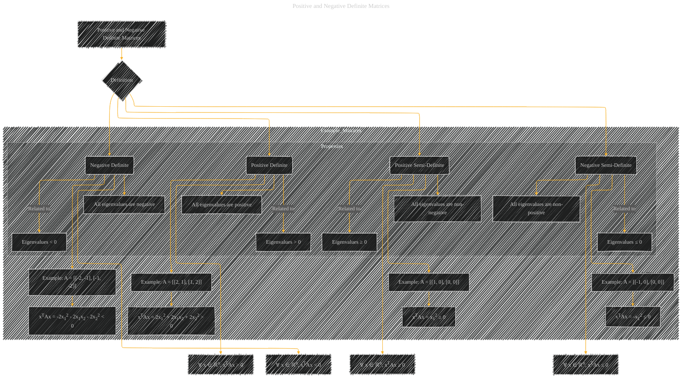

# Positive and Negative Definite Matrices
> **Disclaimer:**
>
> This document contains my personal notes on the topic,
> compiled from publicly available documentation and various cited sources.
> The materials are intended for educational purposes, personal study, and reference.
> The content is dual-licensed:
> 1. **MIT License:** Applies to all code implementations (Swift, Mermaid, and other programming languages).
> 2. **Creative Commons Attribution 4.0 International License (CC BY 4.0):** Applies to all non-code content, including text, explanations, diagrams, and illustrations.
---

## A Diagram Structure

---

### Explanation

* **Definition (B):** This node represents the fundamental criteria for classifying matrices.
* **Positive Definite (C):** This node details the condition for a positive definite matrix:  For *every* non-zero vector x in n-dimensional space, the quadratic form xTAx must be greater than zero.  The example shows a 2x2 positive definite matrix and demonstrates how to evaluate the condition.
* **Negative Definite (D):** Similarly, this node defines a negative definite matrix where the quadratic form is always negative for any non-zero vector x.
* **Positive Semi-Definite (E):**  This node describes the condition where the quadratic form is non-negative for any vector x, including zero.
* **Negative Semi-Definite (F):** This node defines matrices where the quadratic form is always non-positive.
* **Properties (subgraph):** This subgraph highlights the critical link between eigenvalues and the definiteness. Positive definite matrices have all positive eigenvalues, negative definite matrices have all negative eigenvalues, and so on.  The example evaluations (CA2, DA2, etc.) explicitly demonstrate how to check the definiteness conditions for example matrices.

---

### Important Considerations

* **Vectors:** The diagram emphasizes the role of vectors (x ∈ ℝn) in the definiteness criteria.
* **Quadratic Forms:** The crucial concept is the evaluation of quadratic forms (xTAx) for different vectors x.
* **Eigenvalues:** The strong connection between eigenvalues and definiteness is highlighted, with direct links to the properties of eigenvalues being positive, negative, or zero.
* **Examples:**  Explicit examples are provided (e.g., the 2x2 matrices) to illustrate the concepts concretely.

This diagram provides a structured and visual way to understand the properties of positive and negative definite matrices, linking the abstract mathematical definitions to practical evaluations. Remember to tailor the examples to the specific dimensionality and context you need.

---
**Licenses:**

- **MIT License:**   - Full text in [LICENSE](LICENSE) file.
- **Creative Commons Attribution 4.0 International:**  - Legal details in [LICENSE-CC-BY](LICENSE-CC-BY) and at [Creative Commons official site](http://creativecommons.org/licenses/by/4.0/).

---