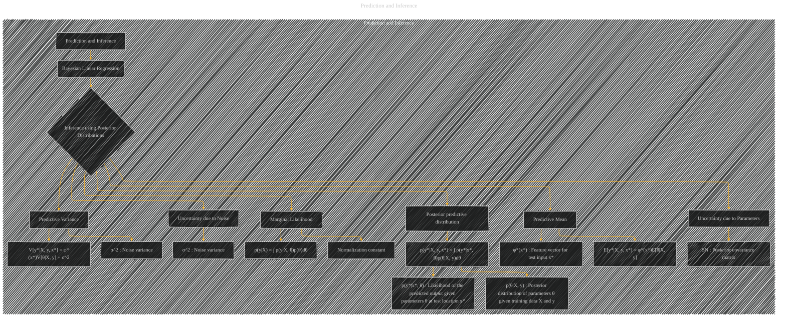

# Prediction and Inference
> **Disclaimer:**
>
> This document contains my personal notes on the topic,
> compiled from publicly available documentation and various cited sources.
> The materials are intended for educational purposes, personal study, and reference.
> The content is dual-licensed:
> 1. **MIT License:** Applies to all code implementations (Swift, Mermaid, and other programming languages).
> 2. **Creative Commons Attribution 4.0 International License (CC BY 4.0):** Applies to all non-code content, including text, explanations, diagrams, and illustrations.
---

## Prediction and Inference - A Diagram Structure

---

### Explanation

This Mermaid diagram visualizes the process of prediction and inference in Bayesian Linear Regression, following a structure similar to the previous examples.

* **Prediction and Inference (Subgraph):**  Encompasses the entire process.
* **Bayesian Linear Regression (Node B):**  The model under consideration.
* **Inference using Posterior Distributions (Node C):**  The core idea is using the posterior distribution to make predictions.
* **Posterior predictive distribution (Node CA):** This is the primary outcome of the inference process.
* **Marginal Likelihood (Node CE):** The normalizing constant that ensures the posterior integrates to 1.
* **Predictive Mean (Node CH):** The expected value of the prediction, calculated by averaging over the posterior distribution of parameters.
* **Predictive Variance (Node CK):** The variability associated with the prediction, considering both the parameter uncertainty and the noise.  The noise variance (σ^2) and posterior covariance of the parameters (SN) are clearly distinguished as contributing factors to the overall uncertainty.
* **Uncertainty due to Parameters (Node CN):**  This part emphasizes the role of the posterior parameter uncertainty in the prediction variance.
* **Uncertainty due to Noise (Node CP):**  This part highlights the impact of the noise variance on the prediction variance.

---

### Key Relationships and Concepts Illustrated

* **Bayes' Theorem:** Implicitly illustrated through the equation for the posterior predictive distribution and marginal likelihood.
* **Integration:** The process of integrating over the posterior parameter distribution (θ) is visually represented.
* **Mean and Variance:** The diagram clearly depicts how the predictive mean and variance are derived from the posterior distribution.
* **Uncertainty Quantification:**  The diagram explicitly shows how uncertainty in parameters and noise contributes to the overall uncertainty in predictions.

This diagram, like the previous ones, can be further expanded by adding more specific details about the components, such as particular equations and formulas for calculating the predictive mean and variance or linking these concepts to related sections of the original document.

---
**Licenses:**

- **MIT License:**   - Full text in [LICENSE](LICENSE) file.
- **Creative Commons Attribution 4.0 International:**  - Legal details in [LICENSE-CC-BY](LICENSE-CC-BY) and at [Creative Commons official site](http://creativecommons.org/licenses/by/4.0/).

---