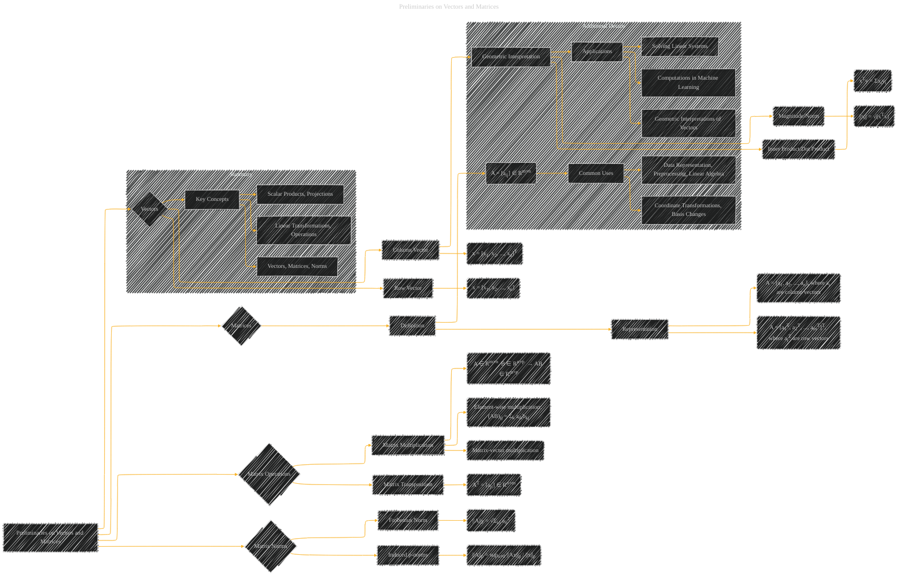

# Preliminaries on Vectors and Matrices
> **Disclaimer:**
>
> This document contains my personal notes on the topic,
> compiled from publicly available documentation and various cited sources.
> The materials are intended for educational purposes, personal study, and reference.
> The content is dual-licensed:
> 1. **MIT License:** Applies to all code implementations (Swift, Mermaid, and other programming languages).
> 2. **Creative Commons Attribution 4.0 International License (CC BY 4.0):** Applies to all non-code content, including text, explanations, diagrams, and illustrations.
---

## Preliminaries on Vectors and Matrices - A Diagram Structure

---

### Explanation

This Mermaid diagram visually represents the "Preliminaries on Vectors and Matrices" section. It uses nodes and relationships to clarify the definitions and key concepts.  Each subgraph helps organize related information.

*   **Vectors:** Defines column and row vectors, shows the relationship between their geometric interpretations (magnitude/norm), and inner products.
*   **Matrices:** Explains matrix definition, common representations (column/row vector formats), and the significance of matrix multiplication.
*   **Matrix Operations:** Includes matrix transposition, highlighting its purpose and how it affects the representation of data.
*   **Matrix Norms:** Introduces the Frobenius norm and induced p-norms, emphasizing their role in measuring the magnitude of matrices.
*   **Summary:** Summarizes the overall structure of the concepts.
*   **Additional Details:** Expands on the applications of these concepts, making the content more practical and less abstract.

This structured diagram effectively encapsulates the core information, offering a visual roadmap for understanding the preliminaries. Remember that this is a general structure; you'd need to tailor it further with specific details from the document.

---
**Licenses:**

- **MIT License:**   - Full text in [LICENSE](LICENSE) file.
- **Creative Commons Attribution 4.0 International:**  - Legal details in [LICENSE-CC-BY](LICENSE-CC-BY) and at [Creative Commons official site](http://creativecommons.org/licenses/by/4.0/).

---