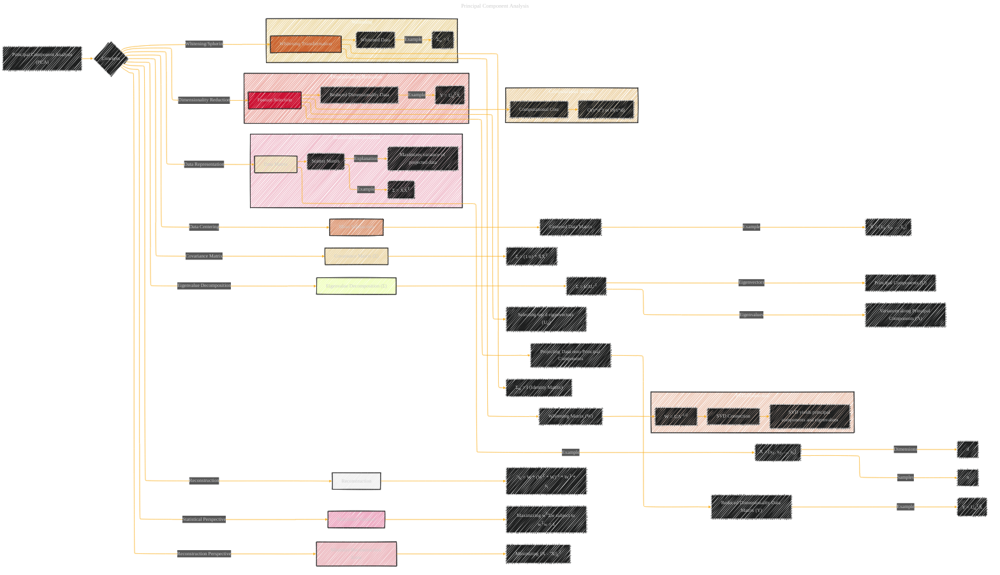

# Principal Component Analysis
> **Disclaimer:**
>
> This document contains my personal notes on the topic,
> compiled from publicly available documentation and various cited sources.
> The materials are intended for educational purposes, personal study, and reference.
> The content is dual-licensed:
> 1. **MIT License:** Applies to all code implementations (Swift, Mermaid, and other programming languages).
> 2. **Creative Commons Attribution 4.0 International License (CC BY 4.0):** Applies to all non-code content, including text, explanations, diagrams, and illustrations.
---

## Principal Component Analysis - A Diagram Structure

---

### Explanation of the Diagram

This Mermaid diagram illustrates the key concepts of Principal Component Analysis (PCA).  It visually connects the input data matrix, data centering, covariance matrix calculation, eigenvalue decomposition, feature selection (dimensionality reduction), and the concept of whitening. It also includes examples to show the application of the formulas in a practical setting.  The subgraphs provide further contextual explanation and highlight the computational aspects. The diagram emphasizes the duality between the statistical and reconstruction perspectives.  The notation used closely follows the common usage in linear algebra and statistical machine learning.

---
**Licenses:**

- **MIT License:**   - Full text in [LICENSE](LICENSE) file.
- **Creative Commons Attribution 4.0 International:**  - Legal details in [LICENSE-CC-BY](LICENSE-CC-BY) and at [Creative Commons official site](http://creativecommons.org/licenses/by/4.0/).

---