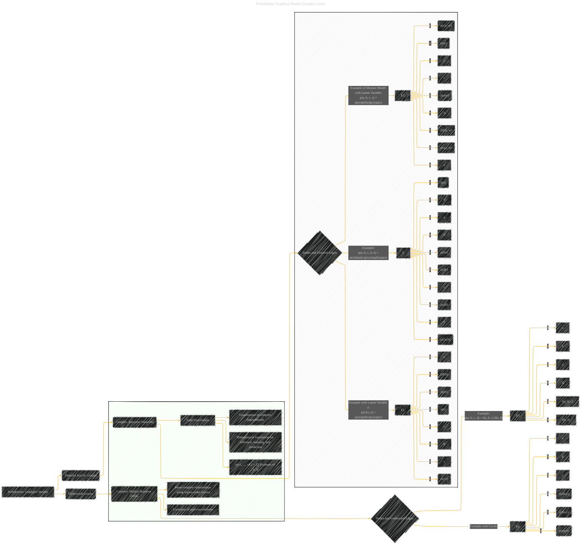

# Probabilistic Graphical Models
> **Disclaimer:**
>
> This document contains my personal notes on the topic,
> compiled from publicly available documentation and various cited sources.
> The materials are intended for educational purposes, personal study, and reference.
> The content is dual-licensed:
> 1. **MIT License:** Applies to all code implementations (Swift, Mermaid, and other programming languages).
> 2. **Creative Commons Attribution 4.0 International License (CC BY 4.0):** Applies to all non-code content, including text, explanations, diagrams, and illustrations.
---

> Note: The initial version is in this [file](./Probabilistic_Distributions.md).

----

## Probabilistic Graphical Models Complex Cases

---

### Explanation of Enhancements

* **Complex Bayesian Networks:** The example now shows a more complex DAG with multiple parents for some nodes and chains of dependencies (e.g., `p(e|d)p(d|c)`).  This demonstrates how more intricate relationships between variables can be represented.

* **Latent Variables:**  Introduced nodes for latent variables (`z`) to show how hidden factors can be incorporated into the model.  This is critical for many machine learning models.

* **Mixture Models:** Illustrates how latent variables can be used in mixture models, where the probability of belonging to a certain class is also modeled.

* **Higher-Order Factors:** Added an example with a higher-order factor (`f(a, b, c)`) in the undirected graph, showing how factors can depend on more than two variables.

* **Cycles:** Included an example with cycles in the undirected graph. Cycles represent feedback loops, which are not present in basic Bayesian networks.  (Important Note:  Cycles introduce more complex computational challenges for inference.)

* **Generalized Equation:**  The summary now uses a generalized equation `p(x1, ..., xK) =  ∏ f(subsets of x_i)` to encompass the variety of possible factorizations.

This revised diagram provides a more comprehensive overview of how probabilistic graphical models can represent complex relationships, highlighting the inclusion of latent variables, mixture models, higher-order factors, and cycles, which are essential for many advanced machine learning applications. Remember that the complexity of the examples is deliberately increased to demonstrate the versatility of the model and potential challenges in working with them. Remember that the precise meaning of the factors will depend on the specific context.

---
**Licenses:**

- **MIT License:**   - Full text in [LICENSE](LICENSE) file.
- **Creative Commons Attribution 4.0 International:**  - Legal details in [LICENSE-CC-BY](LICENSE-CC-BY) and at [Creative Commons official site](http://creativecommons.org/licenses/by/4.0/).

---