# QR Decomposition
> **Disclaimer:**
>
> This document contains my personal notes on the topic,
> compiled from publicly available documentation and various cited sources.
> The materials are intended for educational purposes, personal study, and reference.
> The content is dual-licensed:
> 1. **MIT License:** Applies to all code implementations (Swift, Mermaid, and other programming languages).
> 2. **Creative Commons Attribution 4.0 International License (CC BY 4.0):** Applies to all non-code content, including text, explanations, diagrams, and illustrations.
---

## A Diagram Structure

```mermaid
---
title: QR Decomposition
config:
  layout: elk
  look: handDrawn
  theme: dark
---
%%{
  init: {
    'fontFamily': 'verdana',
    'themeVariables': {
      'primaryColor': '#BB2528',
      'primaryTextColor': '#f529',
      'primaryBorderColor': '#7C0000',
      'lineColor': '#F8B229',
      'secondaryColor': '#006100',
      'tertiaryColor': '#fff'
    }
  }
}%%
graph TD
    A[QR Decomposition] --> B{Matrix Decomposition}
    B --> C[A = QR]
    C --> D[A]
    C --> E[Q]
    C --> F[R]

    D -- Description --> D1["m x n matrix"]
    E -- Description --> E1["Orthogonal matrix<br>(m x m)"]
    F -- Description --> F1["Upper Triangular matrix<br>(m x n)"]


    subgraph QR_Decomposition_Steps["QR Decomposition Steps"]
        E1 --> E2["Q's columns form orthonormal basis for A's column space"]
        E1 --> E3["Columns of Q are mutually orthogonal"]
        E1 --> E4["Q's determinant is ±1"]
        F1 --> F2["Entries below main diagonal are zero"]
        F1 --> F3["Entries along main diagonal (r<sub>11</sub>, r<sub>22</sub>, ..., r<sub>nn</sub>) are non-zero if A is non-singular"]
    end
    

    subgraph Example_QR["Example QR"]
        C --> CA["Example:<br>A = [a<sub>1</sub>, a<sub>2</sub>, a<sub>3</sub>]"]
        CA --> CB["a<sub>1</sub>, a<sub>2</sub>, a<sub>3</sub>: Vectors in R<sup>m</sup>"]
        CB --> CC["A is a matrix with these columns"]
        CC --> CD["Compute the orthonormal basis Q from these vectors using Gram-Schmidt process"]
        CD --> CE["Compute upper triangular matrix R"]
        CE --> CF["R<sub>ij</sub>= a<sub>j</sub><sup>T</sup>q<sub>i</sub>"]
        CF --> CG["A = QR, where Q = [q<sub>1</sub>, q<sub>2</sub>, q<sub>3</sub>] and R is the upper triangular matrix"]
    end
    
```

----

### Explanation of the Diagram

* **A[QR Decomposition]:** The main concept being illustrated.
* **B{Matrix Decomposition}:** The overall process of breaking down a matrix into simpler components.
* **C[A = QR]:** The fundamental equation of QR decomposition, showing the relationship between the original matrix A and the orthogonal matrix Q and the upper triangular matrix R.
* **D[A], E[Q], F[R]:**  Individual components of the decomposition, their roles are explicitly described.
* **D1[m x n matrix], E1[Orthogonal matrix (m x m)], F1[Upper Triangular matrix (m x n)]:** Descriptions of the shapes and properties of each matrix involved.
* **QR_Decomposition_Steps subgraph:**  Detailed steps of the Gram-Schmidt process, crucial for computing Q.
* **Example_QR subgraph:** An example of applying the QR decomposition to a matrix. It shows that the QR decomposition is computed step by step, and how the values are calculated.

This diagram provides a comprehensive overview of QR decomposition, highlighting the key components, their properties, and a practical example to illustrate the process.  The use of subgraphs improves readability and allows for a deeper exploration of specific aspects of the decomposition.  The example further clarifies the practical computation involved.

---
**Licenses:**

- **MIT License:**   - Full text in [LICENSE](LICENSE) file.
- **Creative Commons Attribution 4.0 International:**  - Legal details in [LICENSE-CC-BY](LICENSE-CC-BY) and at [Creative Commons official site](http://creativecommons.org/licenses/by/4.0/).

---