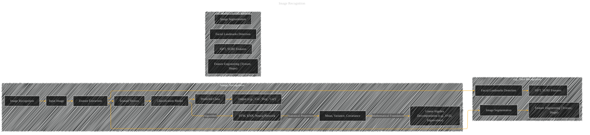
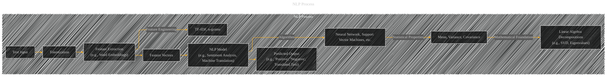
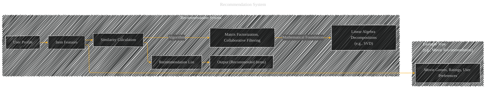

# Real-world Applications in Machine Learning
> **Disclaimer:**
>
> This document contains my personal notes on the topic,
> compiled from publicly available documentation and various cited sources.
> The materials are intended for educational purposes, personal study, and reference.
> The content is dual-licensed:
> 1. **MIT License:** Applies to all code implementations (Swift, Mermaid, and other programming languages).
> 2. **Creative Commons Attribution 4.0 International License (CC BY 4.0):** Applies to all non-code content, including text, explanations, diagrams, and illustrations.
---

Here are some conceptual real-world applications, using the diagram structure strategies from previous responses, illustrating how the discussed mathematical techniques are used in different domains:

---

## 1. Image Recognition and Classification

*   **Description:** This diagram shows the general process of image recognition. Raw input images are processed to extract features (e.g., edges, textures).  These features are used by a classification model (like SVM, KNN, or a neural network) to predict the class of the image. Statistical properties (mean, variance, covariance) of the features are crucial to the model's performance and training process, which in turn rely on linear algebra decompositions to extract relevant data from the image.

*   **Specific Examples:**  The subgraphs illustrate specific applications: Face recognition using facial landmarks and feature extraction techniques like SIFT and SURF.  Medical image analysis uses segmentation and feature engineering to extract texture and shape characteristics, critical for diagnoses.

----

## 2. Natural Language Processing (NLP)

*   **Description:** This diagram shows NLP processing. Text input is tokenized (broken down into words or phrases).  Feature extraction techniques (like word embeddings or TF-IDF) create numerical vectors from the tokens.  These vectors are then processed by an NLP model, like sentiment analysis or machine translation, which uses algorithms like neural networks or SVMs.

---

## 3. Recommendation Systems

*   **Description:**  User profiles and item features are used to calculate similarities between users or items.  Matrix factorization or collaborative filtering algorithms are frequently employed. SVD is a crucial technique for dimensionality reduction and latent factor extraction in recommendation systems.

These are just starting points.  You can further customize these diagrams by adding more specific details based on the particular real-world application and the level of detail required. Remember to always link the algorithms back to the fundamental mathematical concepts and statistical properties to make the diagrams meaningful.

---
**Licenses:**

- **MIT License:**   - Full text in [LICENSE](LICENSE) file.
- **Creative Commons Attribution 4.0 International:**  - Legal details in [LICENSE-CC-BY](LICENSE-CC-BY) and at [Creative Commons official site](http://creativecommons.org/licenses/by/4.0/).

---