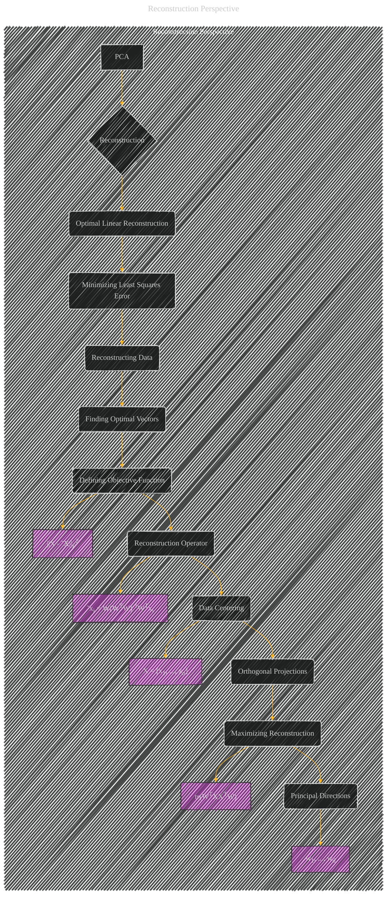

# Reconstruction Perspective
> **Disclaimer:**
>
> This document contains my personal notes on the topic,
> compiled from publicly available documentation and various cited sources.
> The materials are intended for educational purposes, personal study, and reference.
> The content is dual-licensed:
> 1. **MIT License:** Applies to all code implementations (Swift, Mermaid, and other programming languages).
> 2. **Creative Commons Attribution 4.0 International License (CC BY 4.0):** Applies to all non-code content, including text, explanations, diagrams, and illustrations.
---

## Reconstruction Perspective - A Diagram Structure

---

### Explanation

This Mermaid diagram visually depicts the "Reconstruction Perspective" of Principal Component Analysis (PCA).

*   **Subgraph:**  The `Reconstruction_Perspective` subgraph encapsulates the core concepts related to this perspective.
*   **Nodes:**  The diagram uses nodes to represent key concepts like "Optimal Linear Reconstruction," "Minimizing Least Squares Error," and "Finding Optimal Vectors."
*   **Edges:**  Edges connect related concepts, showing the flow of ideas.  For example, the "Minimizing Least Squares Error" concept leads directly to the "Reconstructing Data" and "Finding Optimal Vectors" stages.
*   **Key Equations:**  Crucially, the diagram incorporates the key equation "||X - ˜X||F2" (Frobenius norm of the difference between the original and reconstructed data), representing the core objective of the reconstruction.  Similarly, other key mathematical expressions (e.g., the reconstruction operator equation) are highlighted for clarity.
*   **Contextual Information:**  The diagram includes nodes like "Data Centering," "Orthogonal Projections," and "Maximizing Reconstruction" to provide a comprehensive view of the reconstruction process within PCA, reflecting the mathematical underpinnings discussed in the lecture notes.

This diagram, using the provided structure, effectively illustrates the "Reconstruction Perspective" by showing the steps involved in reconstructing data using principal components and the mathematical principles that drive this process. Remember that the exact detail within each node could be expanded further to match the specific aspects of the original document.

---
**Licenses:**

- **MIT License:**   - Full text in [LICENSE](LICENSE) file.
- **Creative Commons Attribution 4.0 International:**  - Legal details in [LICENSE-CC-BY](LICENSE-CC-BY) and at [Creative Commons official site](http://creativecommons.org/licenses/by/4.0/).

---