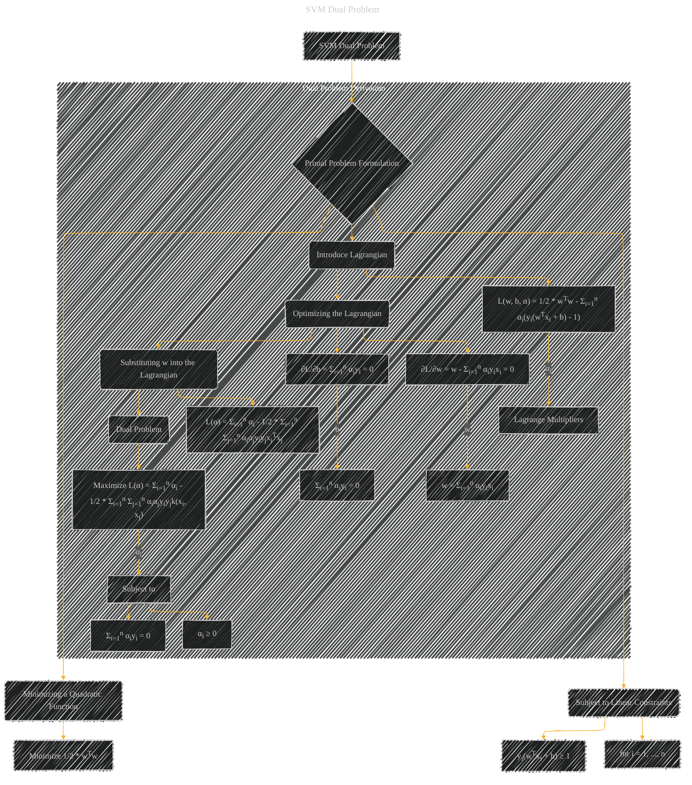

# SVM Dual Problem
> **Disclaimer:**
>
> This document contains my personal notes on the topic,
> compiled from publicly available documentation and various cited sources.
> The materials are intended for educational purposes, personal study, and reference.
> The content is dual-licensed:
> 1. **MIT License:** Applies to all code implementations (Swift, Mermaid, and other programming languages).
> 2. **Creative Commons Attribution 4.0 International License (CC BY 4.0):** Applies to all non-code content, including text, explanations, diagrams, and illustrations.
---

## SVM Dual Problem - A Diagram Structure

---

### Explanation

* **Primal Problem Formulation (B):**  The initial SVM problem is to minimize a quadratic function (1/2 * wTw) subject to linear constraints (yi(wTxi + b) ≥ 1 for each training example (xi, yi)).

* **Introduce Lagrangian (E):** A Lagrangian function is constructed, combining the objective function and the constraints.  Lagrange multipliers (αi) are introduced to handle the constraints.

* **Optimizing the Lagrangian (F):** The partial derivatives of the Lagrangian with respect to w and b are set to zero.  Solving these yields expressions for w and b in terms of the Lagrange multipliers.

* **Substituting and Dual Problem (G & H):** Substituting the expressions for w and b (from step F) back into the Lagrangian function gives a function of only the Lagrange multipliers (αi).  This new function represents the dual problem: to maximize the Lagrangian with respect to αi, subject to the constraints that αi ≥ 0 and Σi=1n αiyi = 0.

---

### Key Concepts Illustrated

* **Lagrangian Duality:** The diagram illustrates the transformation from the primal problem to the dual problem.
* **Lagrange Multipliers:**  The role of Lagrange multipliers (αi) in handling the constraints is highlighted.
* **Kernel Trick (implicitly):** The diagram uses `k(xi, xj)`  (kernel function), which is crucial for handling non-linearly separable data, but the diagram does not explicitly showcase the kernel trick itself.

This diagram provides a clear and structured view of the derivation of the SVM dual problem, incorporating the concepts of Lagrangian duality and the role of constraints.  It highlights the mathematical transformations and connections between the primal and dual formulations. Remember to replace the generic kernel function `k(xi, xj)` with the specific kernel being used in the context of the document.

---
**Licenses:**

- **MIT License:**   - Full text in [LICENSE](LICENSE) file.
- **Creative Commons Attribution 4.0 International:**  - Legal details in [LICENSE-CC-BY](LICENSE-CC-BY) and at [Creative Commons official site](http://creativecommons.org/licenses/by/4.0/).

---