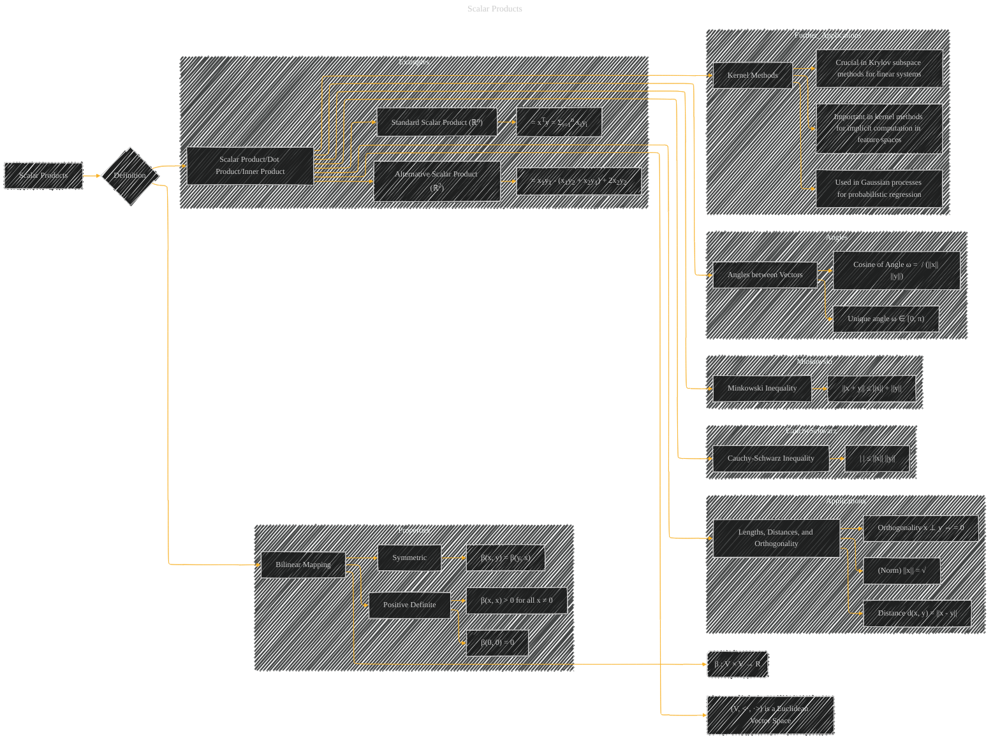

# Scalar Products
> **Disclaimer:**
>
> This document contains my personal notes on the topic,
> compiled from publicly available documentation and various cited sources.
> The materials are intended for educational purposes, personal study, and reference.
> The content is dual-licensed:
> 1. **MIT License:** Applies to all code implementations (Swift, Mermaid, and other programming languages).
> 2. **Creative Commons Attribution 4.0 International License (CC BY 4.0):** Applies to all non-code content, including text, explanations, diagrams, and illustrations.
---

## A Diagram Structure

----

### Explanation

This Mermaid diagram visually represents the concept of scalar products.  It's structured to show the definition, properties, examples, and applications of scalar products in a vector space.  Key components are:

*   **Definition:** The diagram starts by defining scalar products as a specific type of bilinear mapping. It highlights the crucial properties of symmetry and positive definiteness.

*   **Properties:** It clearly outlines the symmetric and positive definite properties, which are essential for a scalar product.

*   **Examples:** It provides concrete examples of scalar products, including the standard dot product in Rn and a more complex example in R2. This makes the abstract concept more concrete.

*   **Applications:** It shows how scalar products are fundamental for calculating lengths, distances, and orthogonality in vector spaces. This section is further expanded to highlight their role in various machine learning techniques like kernel methods and Gaussian processes.

*   **Cauchy-Schwarz and Minkowski Inequalities:** These important inequalities are highlighted, showing their relation to scalar products.

*   **Angles between vectors:** The diagram shows how the scalar product can be used to find the cosine of the angle between two vectors.

This detailed representation helps in understanding the concept's various aspects and its importance in various mathematical and computational contexts. Remember that you can adapt this diagram to specific examples or equations from your reference material. Remember to include the relevant mathematical equations inline or as annotations in the graph for clarity and context.

---
**Licenses:**

- **MIT License:**   - Full text in [LICENSE](LICENSE) file.
- **Creative Commons Attribution 4.0 International:**  - Legal details in [LICENSE-CC-BY](LICENSE-CC-BY) and at [Creative Commons official site](http://creativecommons.org/licenses/by/4.0/).

---