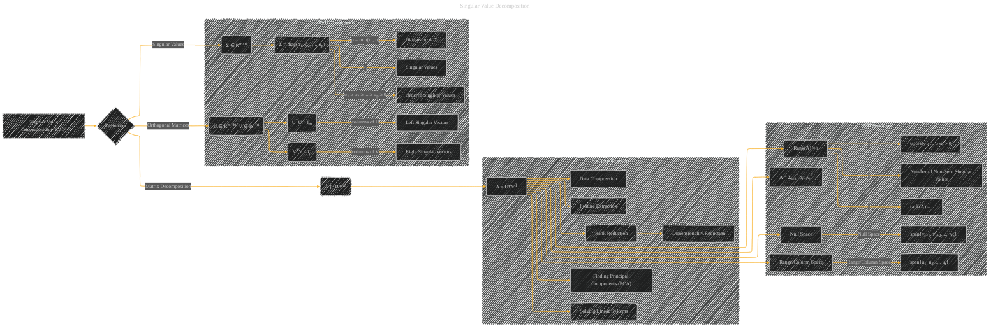

# Singular Value Decomposition
> **Disclaimer:**
>
> This document contains my personal notes on the topic,
> compiled from publicly available documentation and various cited sources.
> The materials are intended for educational purposes, personal study, and reference.
> The content is dual-licensed:
> 1. **MIT License:** Applies to all code implementations (Swift, Mermaid, and other programming languages).
> 2. **Creative Commons Attribution 4.0 International License (CC BY 4.0):** Applies to all non-code content, including text, explanations, diagrams, and illustrations.
---

## Singular Value Decomposition - A Diagram Structure

---

### Explanation and Considerations

* **`A[Singular Value Decomposition (SVD)]`**:  This is the main node, representing the overall concept.
* **`B{Definition}`**:  Indicates the purpose of the diagram.
* **`C(A ∈ Rm×n)`**:  A matrix A with dimensions m x n.
* **`C1(U ∈ Rm×m, V ∈ Rn×n)`**: Orthogonal matrices U (m x m) and V (n x n).  Critically, they are orthogonal.  The `E` and `F` nodes further explain the orthogonality properties.
* **`C2(Σ ∈ Rm×n)`**:  The singular value matrix Σ.  Crucially, it's a diagonal matrix.  Nodes `G`, `H`, and `I` elaborate on this.
* **`D[A = UΣVT]`**: The core equation for SVD, showing the relationship between the matrix A and its decomposition.
* **`SVD_Components` subgraph**:  Explores the key components of the SVD decomposition, emphasizing the relationships between matrices.
* **`SVD_Applications` subgraph**:  Highlights the practical applications of SVD in various contexts.
* **`SVD_Formulae` subgraph**:  Connects the core equation to more detailed mathematical properties, such as rank, null space, and range.

---

### Key Concepts Illustrated

* **Orthogonality:** The diagram emphasizes the orthogonality of the columns of U and V, which is a defining characteristic of the decomposition.
* **Singular Values:** The diagram clearly defines singular values (σi) as the diagonal elements of Σ.
* **Left and Right Singular Vectors:**  The diagram labels the columns of U and V as left and right singular vectors, respectively.
* **Rank, Null Space, and Range:**  The connections to the mathematical properties like rank, null space, and range make the diagram informative for a deeper understanding of SVD's impact on the structure of a matrix.

This diagram, following the structure and concepts in the previous response, effectively represents the core components and applications of Singular Value Decomposition. Remember to tailor the specific detail and connections to the context of your intended audience.

---
**Licenses:**

- **MIT License:**   - Full text in [LICENSE](LICENSE) file.
- **Creative Commons Attribution 4.0 International:**  - Legal details in [LICENSE-CC-BY](LICENSE-CC-BY) and at [Creative Commons official site](http://creativecommons.org/licenses/by/4.0/).

---