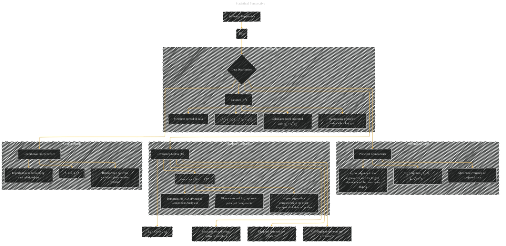

# Statistical Perspective
> **Disclaimer:**
>
> This document contains my personal notes on the topic,
> compiled from publicly available documentation and various cited sources.
> The materials are intended for educational purposes, personal study, and reference.
> The content is dual-licensed:
> 1. **MIT License:** Applies to all code implementations (Swift, Mermaid, and other programming languages).
> 2. **Creative Commons Attribution 4.0 International License (CC BY 4.0):** Applies to all non-code content, including text, explanations, diagrams, and illustrations.
---

## Statistical Perspective - A Diagram Structure

---

### Explanation

This Mermaid diagram illustrates the statistical perspective on data analysis, focusing on the concepts of variance, covariance, and principal components.

* **Data (B):** The starting point is the data itself.

* **Data Distribution (C):**  The diagram emphasizes understanding the distribution of the data, not just the data points themselves.

* **Covariance Matrix (D):**  The core of the statistical perspective is the covariance matrix, highlighting how it measures relationships between variables.  Crucially, it showcases the relationships between variables, and the variances and covariances of these relationships.

* **Variance (E):** The diagram emphasizes variance as a measure of data spread. The formula for variance is explicitly included. This is particularly relevant to understanding how the variance of data changes when projected onto new spaces, e.g., when looking at principal components.

* **Principal Components (F):**  The diagram highlights the goal of maximizing the variance of projected data, leading to the concept of principal components. The formula for finding the optimal projection (wo) is also shown.

* **Covariance Matrix XXT (G):**  Emphasizes the critical role of the covariance matrix in PCA, showing that its eigenvectors are principal components and its eigenvalues relate to their importance.

* **Conditional Independence (H):** The diagram includes the concept of conditional independence, which is a crucial statistical notion that's used in various models to understand how variables relate to each other, given the presence of other variables.

This diagram aims to convey a clear picture of the statistical considerations underlying the techniques and models described, specifically, the fundamental importance of covariance and its role in PCA.  It does not discuss specific implementations, but focuses on the underlying statistical concepts. Remember to adjust the detail level according to the specific needs of the target audience.

---
**Licenses:**

- **MIT License:**   - Full text in [LICENSE](LICENSE) file.
- **Creative Commons Attribution 4.0 International:**  - Legal details in [LICENSE-CC-BY](LICENSE-CC-BY) and at [Creative Commons official site](http://creativecommons.org/licenses/by/4.0/).

---