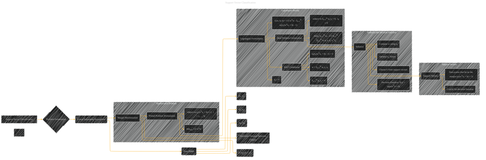

# Support Vector Classification
> **Disclaimer:**
>
> This document contains my personal notes on the topic,
> compiled from publicly available documentation and various cited sources.
> The materials are intended for educational purposes, personal study, and reference.
> The content is dual-licensed:
> 1. **MIT License:** Applies to all code implementations (Swift, Mermaid, and other programming languages).
> 2. **Creative Commons Attribution 4.0 International License (CC BY 4.0):** Applies to all non-code content, including text, explanations, diagrams, and illustrations.
---

## Support Vector Classification - A Diagram Structure

---

### Explanation of the Diagram

* **Problem Formulation (Node B):**  Defines the core objective of finding a linear hyperplane that maximizes the margin between two classes of data points.
* **Data Points (Node D):**  Illustrates the input data (xi, yi) pairs where xi are data points and yi are their associated labels (+1 or -1).
* **Margin Maximization (Node E):** Highlights the key idea of maximizing the distance between the separating hyperplane and the closest data points from each class.
* **Primal Problem Formulation (Node F):**  Shows the mathematical representation of the optimization problem to find the optimal hyperplane (w, b) that minimizes 1/2 wTw.
* **Lagrangian Formulation (Node G):**  Introduces the Lagrangian function, incorporating the constraints into the objective function using Lagrange multipliers (αi).
* **KKT Conditions (Node GD):**  Specifies the Karush-Kuhn-Tucker conditions, necessary for optimality, which relate the Lagrange multipliers (αi) to the data points.
* **Support Vectors (Node I):**  Emphasizes the crucial role of support vectors (data points on the margin) in determining the separating hyperplane and the decision function.
* **Solution and Decision Function (Node H):**  Describes how the optimal solution (w, b) is obtained from the dual problem and how it's used in the decision function to classify new data points.
* **Dual Problem Formulation (Node GC):** Shows the dual problem formulation for easier computation, using the kernel trick (k(xi, xj) = xiTxj) to compute inner products efficiently in higher-dimensional spaces (although not explicitly mentioned here, this is implicit if the data aren't linearly separable).

This diagram provides a structured overview of Support Vector Classification, highlighting the core concepts and their mathematical representations.  It's designed to be easily adaptable and extendable to illustrate further details as needed.  Remember to replace placeholders like x1, x2, ..., with specific data points if you are illustrating a particular example.

---
**Licenses:**

- **MIT License:**   - Full text in [LICENSE](LICENSE) file.
- **Creative Commons Attribution 4.0 International:**  - Legal details in [LICENSE-CC-BY](LICENSE-CC-BY) and at [Creative Commons official site](http://creativecommons.org/licenses/by/4.0/).

---