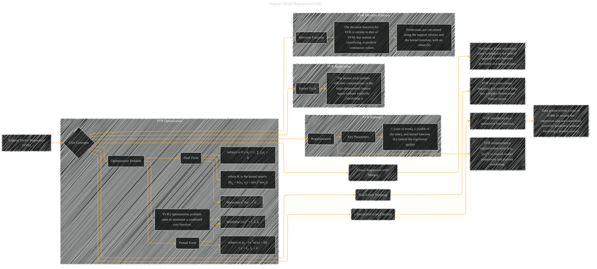

# Support Vector Regression
> **Disclaimer:**
>
> This document contains my personal notes on the topic,
> compiled from publicly available documentation and various cited sources.
> The materials are intended for educational purposes, personal study, and reference.
> The content is dual-licensed:
> 1. **MIT License:** Applies to all code implementations (Swift, Mermaid, and other programming languages).
> 2. **Creative Commons Attribution 4.0 International License (CC BY 4.0):** Applies to all non-code content, including text, explanations, diagrams, and illustrations.
---

## Support Vector Regression - A Diagram Structure

---

### Explanation and Considerationss

* **Core Concepts (B):**  This is the top-level grouping of the key elements that define SVR.

* **Linear Regression with Margin (C):**  Illustrates the foundation in traditional linear regression, showing how SVR builds upon it.

* **Non-linear Mapping (D):**  SVR's capability to handle non-linear data relationships is highlighted.  It maps input data into a higher-dimensional space via a mapping function (φ).

* **ε-Insensitive Loss Function (E):** Shows how SVR defines an error function that tolerates deviations within a certain margin.  The error doesn't incur a penalty if the point falls within the `ε` tube.

* **Regularization (F):** This is a crucial component that prevents overfitting. The added regularization term (e.g., L2 norm) controls the complexity of the SVR model.

* **Optimization Problem (G):** This subgraph breaks down the optimization problem into primal and dual forms.  Key components of the optimization, like the kernel matrix, are shown.

* **Kernel Trick (H):** Explains the essential idea behind how SVR efficiently handles high-dimensional feature spaces without needing to compute the mapping φ directly.

* **Decision Function (I):**  Describes how SVR computes predictions using support vectors and the kernel function, demonstrating its ability to predict continuous values rather than classifying data into discrete categories.

* **Key Parameters (FB):**  Highlights the crucial parameters that affect the quality and complexity of the SVR model.

* **Application (SVR_Application):** Showcases the use cases of SVR, connecting it to real-world problems.

---

### Diagram Style Considerations

* **Clarity:** Use clear node labels and concise descriptions.
* **Hierarchy:** Employ subgraphs to organize related concepts and clarify the structure.
* **Visual Connections:** Use clear edges to show relationships between concepts.
* **Mathematical Precision:**  Include mathematical expressions (like the cost function formulas) where appropriate.
* **Emphasis on Key Concepts:** Clearly highlight the core ideas, such as the ε-insensitive loss and the kernel trick.

This improved diagram more accurately reflects the key components of SVR and provides a clearer structure for understanding the method. Remember to tailor specific nodes and edges to reflect the specific details of the document being visualized.

---
**Licenses:**

- **MIT License:**   - Full text in [LICENSE](LICENSE) file.
- **Creative Commons Attribution 4.0 International:**  - Legal details in [LICENSE-CC-BY](LICENSE-CC-BY) and at [Creative Commons official site](http://creativecommons.org/licenses/by/4.0/).

---