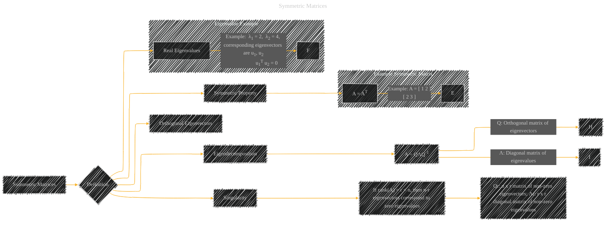

# Symmetric Matrices
> **Disclaimer:**
>
> This document contains my personal notes on the topic,
> compiled from publicly available documentation and various cited sources.
> The materials are intended for educational purposes, personal study, and reference.
> The content is dual-licensed:
> 1. **MIT License:** Applies to all code implementations (Swift, Mermaid, and other programming languages).
> 2. **Creative Commons Attribution 4.0 International License (CC BY 4.0):** Applies to all non-code content, including text, explanations, diagrams, and illustrations.
---

## Symmetric Matrices - A Diagram Structure

---

### Explanation

This Mermaid diagram represents the key properties and characteristics of symmetric matrices.  It's designed to be easily understood and provides concrete examples to illustrate the concepts.

* **Definition:** The diagram starts by defining a symmetric matrix as a square matrix equal to its transpose.
* **Eigenvalues and Eigenvectors:** It highlights that symmetric matrices have real eigenvalues and orthogonal eigenvectors.  The example illustrates these points.
* **Eigendecomposition:** The diagram shows the eigendecomposition formula (`A = QΛQ-1`).  It visually connects the matrix `A` with the orthogonal matrix of eigenvectors (`Q`) and the diagonal matrix of eigenvalues (`Λ`).
* **Singularity:** The diagram addresses the case where a symmetric matrix is singular (rank less than its dimension). It defines the components (`Qr` and `Λr`) of the eigendecomposition in the singular case.

This diagram is designed to be intuitive and easy to follow, clearly illustrating the relationship between the definition of a symmetric matrix and its important properties regarding eigenvalues, eigenvectors, and eigendecomposition.  It also incorporates the concept of singularity, which is crucial for understanding the limitations of applying certain operations.

---
**Licenses:**

- **MIT License:**   - Full text in [LICENSE](LICENSE) file.
- **Creative Commons Attribution 4.0 International:**  - Legal details in [LICENSE-CC-BY](LICENSE-CC-BY) and at [Creative Commons official site](http://creativecommons.org/licenses/by/4.0/).

---