# The Gram-Schmidt Process
> **Disclaimer:**
>
> This document contains my personal notes on the topic,
> compiled from publicly available documentation and various cited sources.
> The materials are intended for educational purposes, personal study, and reference.
> The content is dual-licensed:
> 1. **MIT License:** Applies to all code implementations (Swift, Mermaid, and other programming languages).
> 2. **Creative Commons Attribution 4.0 International License (CC BY 4.0):** Applies to all non-code content, including text, explanations, diagrams, and illustrations.
---

## A Diagramatical Version

```mermaid
---
title: The Gram-Schmidt Process
config:
  layout: elk
  look: handDrawn
  theme: dark
---
%%{
  init: {
    'fontFamily': 'verdana',
    'themeVariables': {
      'primaryColor': '#BB2528',
      'primaryTextColor': '#f529',
      'primaryBorderColor': '#7C0000',
      'lineColor': '#F8B229',
      'secondaryColor': '#006100',
      'tertiaryColor': '#fff'
    }
  }
}%%
graph TD
    subgraph Initialization
        A[Input Vectors] --> B{a<sub>1</sub>}
        B --> C[Normalize]
        C --> D{q<sub>1</sub>}
    end
    
    subgraph Gram_Schmidt_Step_1["Gram-Schmidt Step 1"]
        D --> E{a<sub>2</sub>}
        E --> F[Project onto q<sub>1</sub>]
        F --> G{proj<sub>q<sub>1</sub></sub>a<sub>2</sub>}
        G --> H[Subtract from a<sub>2</sub>]
        H --> I{ã<sub>2</sub>}
        I --> J[Normalize]
        J --> K{q<sub>2</sub>}
    end
    
    subgraph Gram_Schmidt_Step_2["Gram-Schmidt Step 2"]
        K --> L{a<sub>3</sub>}
        L --> M[Project onto q<sub>1</sub>]
        M --> N{proj<sub>q<sub>1</sub></sub>a<sub>3</sub>}
        L --> O[Project onto q<sub>2</sub>]
        O --> P{proj<sub>q<sub>2</sub></sub>a<sub>3</sub>}
        N --> Q[Subtract from a<sub>3</sub>]
        P --> R[Subtract from a<sub>3</sub>]
        Q --> S{ã<sub>3</sub>}
        S --> T[Normalize]
        T --> U{q<sub>3</sub>}
    end
    
    subgraph General_Step["General Step"]
        U --> V{a<sub>n</sub>}
        V --> W[Project onto q<sub>1</sub>]
        V --> X[Project onto q<sub>2</sub>]
        V --> Y[Project onto q<sub>n-1</sub>]
        W --> Z{proj<sub>q<sub>1</sub></sub>a<sub>n</sub>}
        X --> AA{proj<sub>q<sub>2</sub></sub>a<sub>n</sub>}
        Y --> BB{proj<sub>q<sub>n-1</sub></sub>a<sub>n</sub>}
        Z --> CC[Subtract from a<sub>n</sub>]
        AA --> DD[Subtract from a<sub>n</sub>]
        BB --> EE[Subtract from a<sub>n</sub>]
        CC --> FF{ã<sub>n</sub>}
        FF --> GG[Normalize]
        GG --> HH{q<sub>n</sub>}
    end

    subgraph Output
        HH --> I[Orthonormal Basis]
        D --proj--> G
        I --proj--> K
        I --proj--> U
    end
    
    style Initialization fill:#f9f5,stroke:#333,stroke-width:1px;
    style Gram_Schmidt_Step_1 fill:#ccf5,stroke:#333,stroke-width:1px;
    style Gram_Schmidt_Step_2 fill:#ccf5,stroke:#333,stroke-width:1px;
    style General_Step fill:#ccf5,stroke:#333,stroke-width:1px;
    style Output fill:#ccf5,stroke:#333,stroke-width:1px;

```

---

### Explanation

This diagram illustrates the Gram-Schmidt process for orthogonalizing a set of vectors.

*   **Input Vectors (a1, a2, a3, ..., an):** The input vectors are linearly independent.
*   **Normalization:** The first vector (a1) is normalized to produce q1.
*   **Projection and Subtraction:**  For each subsequent vector (a2, a3, etc.), its projection onto the previously orthogonalized vectors (q1, q2, etc.) is calculated.  The projections are subtracted from the original vector to obtain a component orthogonal to the previously found orthogonal vectors (ã2, ã3, etc.).
*   **Normalization:** The resulting vector (ã2, ã3, etc.) is normalized to produce the next orthogonal vector in the orthonormal basis (q2, q3, etc.).
*   **Orthonormal Basis (q1, q2, q3, ..., qn):** The final result is a set of orthonormal vectors that form a basis for the same vector space as the original vectors.

---
**Licenses:**

- **MIT License:**   - Full text in [LICENSE](LICENSE) file.
- **Creative Commons Attribution 4.0 International:**  - Legal details in [LICENSE-CC-BY](LICENSE-CC-BY) and at [Creative Commons official site](http://creativecommons.org/licenses/by/4.0/).

---