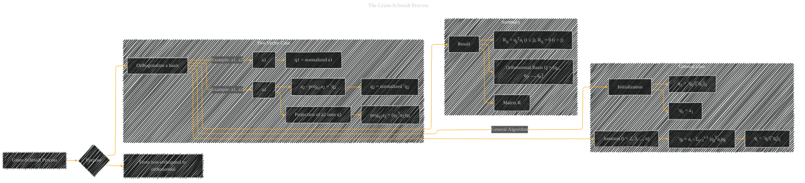

# The Gram-Schmidt Process
> **Disclaimer:**
>
> This document contains my personal notes on the topic,
> compiled from publicly available documentation and various cited sources.
> The materials are intended for educational purposes, personal study, and reference.
> The content is dual-licensed:
> 1. **MIT License:** Applies to all code implementations (Swift, Mermaid, and other programming languages).
> 2. **Creative Commons Attribution 4.0 International License (CC BY 4.0):** Applies to all non-code content, including text, explanations, diagrams, and illustrations.
---

## A Diagram Structure

----

### Explanation

*   **Purpose (B):** The Gram-Schmidt process aims to transform a given basis into an orthonormal basis.  This is useful in various applications, particularly in linear algebra and machine learning where orthonormal bases simplify calculations.

*   **Two-Vector Case (Subgraph):**  Illustrates the core concept of the process for two vectors (`a1` and `a2`).  It shows how to normalize the first vector (`a1`) to `q1`, project the second vector (`a2`) onto `q1`, and then subtract the projection from `a2` to get a vector orthogonal to `q1`, which is then normalized to `q2`.

*   **General Case (Subgraph):** Shows the iterative process that extends the two-vector case to any number of vectors (`a1`, `a2`, ..., `an`).  The algorithm iteratively calculates vectors (`q1`, `q2`, ..., `qn`) that are orthogonal to each other and have a unit norm.

*   **Result (Subgraph):**  Summarizes the outcome of the process: an orthonormal basis (`Q`) and an upper triangular matrix (`R`). The elements of matrix `R` are derived from the dot products between the original basis vectors (`ai`) and the orthonormal vectors (`qj`).  The process results in a matrix `Q` with orthonormal column vectors that span the same space as the original basis vectors.

**Key Concepts and Notation:**

*   **ai:** The original basis vectors.
*   **qi:** The orthonormal basis vectors generated by the process.
*   **projq1a2:** The projection of `a2` onto `q1`.
*   **||v||2:** The Euclidean norm (length) of vector `v`.
*   **qjTai:** The dot product of vector `qj` and `ai`.

This diagram effectively conveys the Gram-Schmidt process's steps and outcomes, focusing on both the intuitive two-vector case and the generalized algorithm for any number of vectors.  The inclusion of the matrix `R` helps in understanding its role in the QR decomposition, a critical application of the Gram-Schmidt process.

---
**Licenses:**

- **MIT License:**   - Full text in [LICENSE](LICENSE) file.
- **Creative Commons Attribution 4.0 International:**  - Legal details in [LICENSE-CC-BY](LICENSE-CC-BY) and at [Creative Commons official site](http://creativecommons.org/licenses/by/4.0/).

---