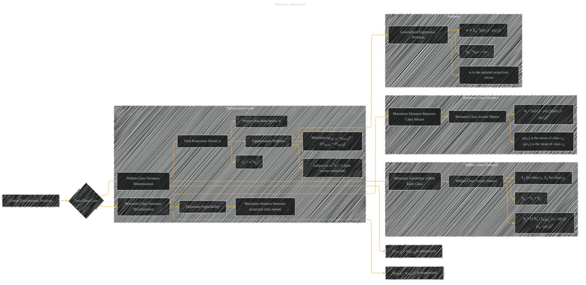

# The Two Class Case
> **Disclaimer:**
>
> This document contains my personal notes on the topic,
> compiled from publicly available documentation and various cited sources.
> The materials are intended for educational purposes, personal study, and reference.
> The content is dual-licensed:
> 1. **MIT License:** Applies to all code implementations (Swift, Mermaid, and other programming languages).
> 2. **Creative Commons Attribution 4.0 International License (CC BY 4.0):** Applies to all non-code content, including text, explanations, diagrams, and illustrations.
---

## The Two Class Case - A Diagram Structure

---

### Explanation

This diagram illustrates the two-class case of Linear Discriminant Analysis (LDA). It breaks down the key concepts into logical components and visually represents how the optimization problem arises from minimizing within-class variance and maximizing between-class variance.

* **Within-Class Variance Minimization:** The goal is to minimize the variability within each class, as measured by the within-class scatter matrix (Sw), which combines the scatter matrices for each class (S1 and S2).

* **Between-Class Variance Maximization:** The aim is to maximize the distance between the projected class means, as captured by the between-class scatter matrix (Sb).

* **Optimization Problem:**  The core optimization problem is to find the projection vector (w) that maximizes the ratio of between-class variance to within-class variance. The constraint ensures the projection vector has unit length.

* **Generalized Eigenvalue Problem:** The solution to this optimization problem is obtained through solving a generalized eigenvalue problem involving Sw-1Sb.

* **Optimal Projection Vector:** The optimal projection vector (w) is a solution to this generalized eigenvalue problem, and is proportional to the inverse of the within-class scatter matrix times the difference between the class means.

The diagram visually connects these concepts through arrows, making it easier to understand the overall process of finding the optimal projection for LDA in the two-class scenario. The inclusion of relevant formulas and annotations makes the diagram more complete and understandable.

---
**Licenses:**

- **MIT License:**   - Full text in [LICENSE](LICENSE) file.
- **Creative Commons Attribution 4.0 International:**  - Legal details in [LICENSE-CC-BY](LICENSE-CC-BY) and at [Creative Commons official site](http://creativecommons.org/licenses/by/4.0/).

---