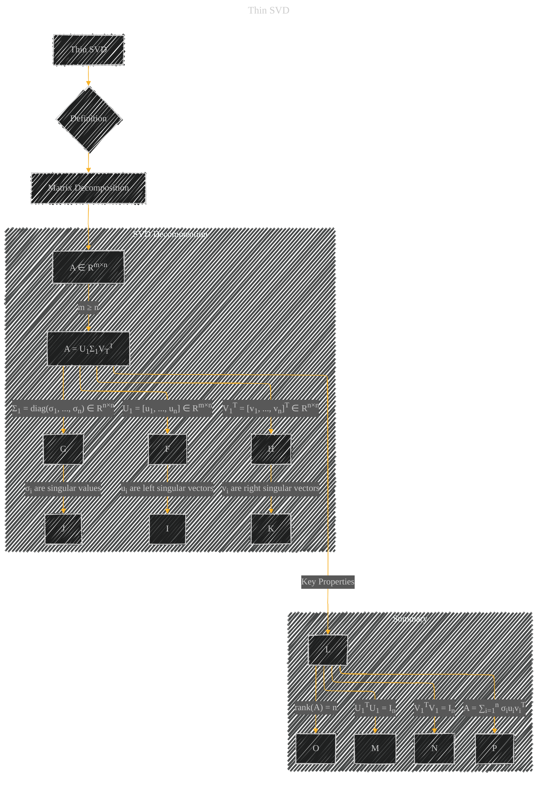

# Thin SVD
> **Disclaimer:**
>
> This document contains my personal notes on the topic,
> compiled from publicly available documentation and various cited sources.
> The materials are intended for educational purposes, personal study, and reference.
> The content is dual-licensed:
> 1. **MIT License:** Applies to all code implementations (Swift, Mermaid, and other programming languages).
> 2. **Creative Commons Attribution 4.0 International License (CC BY 4.0):** Applies to all non-code content, including text, explanations, diagrams, and illustrations.
---

## Thin SVD - A Diagram Structure

---

### Explanation

This Mermaid diagram depicts Thin SVD, focusing on its core definition as a matrix decomposition.

* **A (Thin SVD):** The main topic.
* **B (Definition):**  Indicates that Thin SVD is a specific case of SVD.
* **C (Matrix Decomposition):**  Highlights the core concept that Thin SVD decomposes a matrix.
* **D (A ∈ Rm×n):**  Specifies the input matrix is of size m x n.  Crucially, it emphasizes the condition m ≥ n.
* **E (A = U1Σ1VT1):** This shows the core decomposition formula, emphasizing the subscripts on U, Σ, and V to denote the thin variant.
* **F, G, H (Left Singular Vectors, Singular Values, Right Singular Vectors):** Clearly identifies the components of the decomposition and their significance (singular values are on the diagonal of Σ).
* **I, J, K (Descriptions of Components):** Provides a concise description of the components to help readers understand the diagram's elements.
* **L (Key Properties):**  A subgraph to explicitly show the critical properties that distinguish the thin SVD.
* **M, N, O (Key Properties Details):**  Explains the important properties specific to thin SVD, including orthogonality of U1 and V1, and the rank of A being equal to n.
* **P (Expansion):** Shows the summation form of the decomposition, which helps visualize how the individual components contribute to the entire matrix.

----

### Key Improvements and Considerations

* **Clarity:** Uses clear labels and concise descriptions.
* **Specificity:** Employs precise mathematical notation (e.g., Rm×n, diag(...)) for accuracy.
* **Structure:** Organizes the information logically to guide the reader through the concept.
* **Conditions:** Explicitly shows that Thin SVD applies when *m ≥ n*.

This improved diagram is more focused and informative, helping to clarify the core concept of Thin SVD. Remember that in a real-world application, you would need to provide more specific context about how Thin SVD is used and why.

---
**Licenses:**

- **MIT License:**   - Full text in [LICENSE](LICENSE) file.
- **Creative Commons Attribution 4.0 International:**  - Legal details in [LICENSE-CC-BY](LICENSE-CC-BY) and at [Creative Commons official site](http://creativecommons.org/licenses/by/4.0/).

---