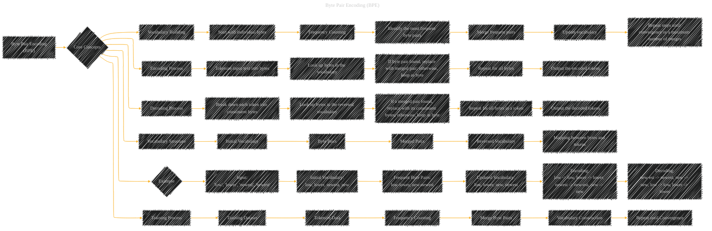

# Byte Pair Encoding (BPE)
> **Disclaimer:**
>
> This document contains my personal notes on the topic,
> compiled from publicly available documentation and various cited sources.
> The materials are intended for educational purposes, personal study, and reference.
> The content is dual-licensed:
> 1. **MIT License:** Applies to all code implementations (Swift, Mermaid, and other programming languages).
> 2. **Creative Commons Attribution 4.0 International License (CC BY 4.0):** Applies to all non-code content, including text, explanations, diagrams, and illustrations.
---

## Byte Pair Encoding - A Diagram Structure

---

### Explanation

* **Core Concepts:**  This subgraph encompasses the fundamental ideas behind BPE. It breaks down the process into key phases.

* **Vocabulary Building:** This section illustrates how the vocabulary is created. The initial vocabulary starts with individual bytes.  Frequency counting is crucial. Byte pairs are merged iteratively until convergence (or a predefined limit).

* **Encoding Process:** This describes how the BPE algorithm turns text into a sequence of tokens. The input is tokenized into individual bytes. The algorithm checks the vocabulary for merged pairs. If found, the pair is replaced.  Crucially, this iterative process of lookup and replacement continues until all input bytes are processed.

* **Decoding Process:** This mirrors the encoding process but reverses it.  Each token is broken down. The reversed vocabulary is used to look up the constituent bytes. The reversed process is essential to recover the original text.

* **Vocabulary Structure:** This section highlights the organization of the BPE vocabulary. It's vital to have clear mappings between original bytes and the merged tokens.

* **Example:** A simple example demonstrates the BPE process using sample input text and frequent byte pairs. This concrete example clarifies the abstract concepts.

* **Training Process:** This subsection shows the training phase of BPE. The dataset is tokenized. Frequencies are counted. Merges are performed iteratively until the vocabulary converges to a stable state.

This Mermaid diagram provides a comprehensive visual representation of the Byte Pair Encoding (BPE) algorithm, covering its core components, the encoding and decoding processes, vocabulary structure, and the training phase.  The example demonstrates how the algorithm works in practice. Remember to adapt and enhance these diagrams with specific details from the actual documentation you are working with.

---
**Licenses:**

- **MIT License:**   - Full text in [LICENSE](LICENSE) file.
- **Creative Commons Attribution 4.0 International:**  - Legal details in [LICENSE-CC-BY](LICENSE-CC-BY) and at [Creative Commons official site](http://creativecommons.org/licenses/by/4.0/).

---