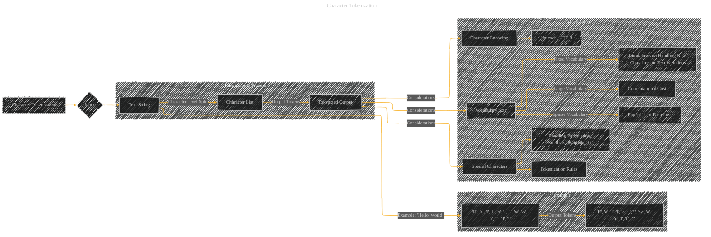

# Character Tokenization
> **Disclaimer:**
>
> This document contains my personal notes on the topic,
> compiled from publicly available documentation and various cited sources.
> The materials are intended for educational purposes, personal study, and reference.
> The content is dual-licensed:
> 1. **MIT License:** Applies to all code implementations (Swift, Mermaid, and other programming languages).
> 2. **Creative Commons Attribution 4.0 International License (CC BY 4.0):** Applies to all non-code content, including text, explanations, diagrams, and illustrations.
---

## Character Tokenization - A Diagram Structure

---

### Explanation

* **Input (B):**  The input to character tokenization is a text string (C).

* **Tokenization Process (subgraph):** The text string is split into individual characters, resulting in a list of characters (D).  This list of characters forms the tokenized output (E).

* **Example (subgraph):** The example shows how the string "Hello, world!" is tokenized into a list of individual characters.  Note that spaces and punctuation marks are treated as characters.

* **Considerations (subgraph):**
    * **Vocabulary Size:**  A large vocabulary (many unique characters) can increase computational cost during processing (e.g., building a vocabulary matrix for a neural network). A sparse vocabulary might result in information loss if some characters appear infrequently. The vocabulary is typically fixed for any given task, so new characters not seen during training will be problematic.

    * **Character Encoding:**  The encoding of characters (e.g., Unicode, UTF-8) must be consistent to avoid issues in character handling and storage.

    * **Special Characters:** Special characters like punctuation, numbers, and symbols need to be explicitly handled in the tokenization rules.

----

### Diagram Adaptation to Different Contexts

* **Specific Tokenization Rules:** Add nodes representing specific rules used during tokenization. For example, if you need to account for capitalization or remove whitespace, add those nodes and edges in the Tokenization Process section.
* **Handling Lowercase/Uppercase:** If case sensitivity is important, this should be reflected as a decision point in the process, with conditional edges for different processing paths based on whether to convert to lowercase or not.

This diagram provides a structured overview of the character tokenization process, including potential issues and considerations that are pertinent to its implementation. Remember that the specific details in the example or in the considerations subgraph need to be adapted according to the specific rules and requirements of the task you're working on.

---
**Licenses:**

- **MIT License:**   - Full text in [LICENSE](LICENSE) file.
- **Creative Commons Attribution 4.0 International:**  - Legal details in [LICENSE-CC-BY](LICENSE-CC-BY) and at [Creative Commons official site](http://creativecommons.org/licenses/by/4.0/).

---