# Custom Tokenization
> **Disclaimer:**
>
> This document contains my personal notes on the topic,
> compiled from publicly available documentation and various cited sources.
> The materials are intended for educational purposes, personal study, and reference.
> The content is dual-licensed:
> 1. **MIT License:** Applies to all code implementations (Swift, Mermaid, and other programming languages).
> 2. **Creative Commons Attribution 4.0 International License (CC BY 4.0):** Applies to all non-code content, including text, explanations, diagrams, and illustrations.
---

## Custom Tokenization - A Diagram Structure

```mermaid
---
title: Custom Tokenization
config:
  layout: elk
  look: handDrawn
  theme: dark
---
%%{
  init: {
    'fontFamily': 'verdana',
    'themeVariables': {
      'primaryColor': '#BB2528',
      'primaryTextColor': '#f529',
      'primaryBorderColor': '#7C0000',
      'lineColor': '#F8B229',
      'secondaryColor': '#006100',
      'tertiaryColor': '#fff'
    }
  }
}%%
graph LR
    A[Custom Tokenization] --> B{What is it?}
    B --> C[Breaking Down Text into Meaningful Units]
    C --> D{Different from Pre-built Tokenizers}
    
    subgraph Prebuilt_Tokenizers["Prebuilt Tokenizers"]
        D -- Pre-built tokenizers use pre-determined rules and vocabularies --> E[Word Tokenization]
        E -- Example:<br>'The quick brown fox' --> F["'The', 'quick', 'brown', 'fox'"]
        E --> E1[Character Tokenization]
        E1 -- Example:<br>'The quick brown fox' --> F1["'T', 'h', 'e', ' ', 'q', 'u', 'i', 'c', 'k', ' ', 'b', 'r', 'o', 'w', 'n', ' ', 'f', 'o', 'x'"]
        E1 --> E2[Subword Tokenization]
        E2 -- Example:<br>'The quick brown fox' --> F2["'The', 'quick', 'brown', 'fox'"]
    end
    
    subgraph Custom_Tokenization["Custom Tokenization"]
        D -- Custom tokenization allows you to tailor tokenization to specific needs --> G[Specific Language]
        G -- Example:<br>Chinese word segmentation --> H[“你好世界”]
        H -- Custom rule:<br>Tokenize based on Chinese characters --> I["'你好', '世界'"]
        G --> G1[Specific Task]
        G1 -- Example:<br>Named Entity Recognition (NER) --> J[“Apple CEO Tim Cook”]
        J -- Custom rule:<br>Tokenize based on named entities --> K["'Apple', 'CEO', 'Tim', 'Cook'"]
        G --> G2[Specific Data Structure]
        G2 -- Example:<br>Medical texts --> L[“Patient has a history of hypertension and diabetes”]
        L -- Custom rule:<br>Tokenize based on medical concepts --> M["'Patient', 'hypertension', 'diabetes'"]
    end

    subgraph Key_Components["Key Components"]
        B --> BB[Custom Rules]
        BB --> BB1[Regular Expressions, Dictionaries, Custom Functions]
        BB --> BB2[Defining the structure]
        BB --> BB3[Specifying the meaningful units of text]

        B --> BC[Input Text]
        BC --> BC1[Input string, document, or dataset]

        B --> BD[Output Tokens]
        BD --> BD1[List of tokens]
        BD --> BD2[Representation of the divided text]
    end


    subgraph Summary
        B --> B1[Purpose]
        B1 --> B11[Tailored for specific domains, tasks, or data types]

        B1 --> B12[Enhance accuracy, precision, efficiency]
        B1 --> B13[Improve model performance, especially for tasks like NER or medical text processing]
    end

```

----

### Explanation

This Mermaid diagram visualizes the concept of custom tokenization.

* **Pre-built Tokenizers:**  The diagram shows examples of common pre-built tokenization methods, like word, character, and subword tokenization, along with their outputs.  This serves as a contrast to highlight the customization aspect of custom tokenization.

* **Custom Tokenization:**  The diagram emphasizes the ability to create tailored tokenization rules based on specific needs.  Examples are provided for languages (Chinese word segmentation), tasks (Named Entity Recognition, NER), and data types (medical texts).  The diagram illustrates how custom rules can extract more relevant or meaningful units from the text.

* **Key Components:** The diagram highlights the critical elements of custom tokenization: custom rules (using regular expressions, dictionaries, or custom functions), input text, and the resulting output tokens.

* **Summary:** The final subgraph summarizes the benefits of custom tokenization: tailored to specific domains and tasks, enhancing accuracy, and improving model performance.

This diagram effectively captures the core ideas and distinctions between pre-built and custom tokenization.  It also provides a template to build on for more complex scenarios.  Adapting it to visualize specific examples from your reference documentation would involve adding nodes representing those specific rules or patterns.

---
**Licenses:**

- **MIT License:**   - Full text in [LICENSE](LICENSE) file.
- **Creative Commons Attribution 4.0 International:**  - Legal details in [LICENSE-CC-BY](LICENSE-CC-BY) and at [Creative Commons official site](http://creativecommons.org/licenses/by/4.0/).

---