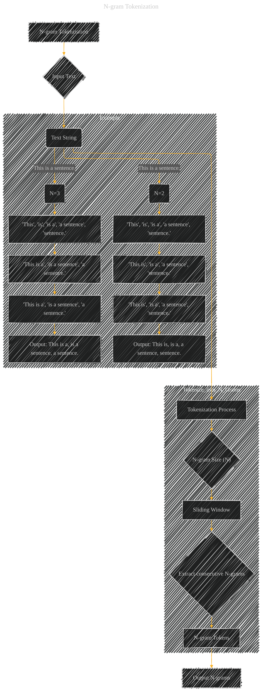

# N-gram Tokenization
> **Disclaimer:**
>
> This document contains my personal notes on the topic,
> compiled from publicly available documentation and various cited sources.
> The materials are intended for educational purposes, personal study, and reference.
> The content is dual-licensed:
> 1. **MIT License:** Applies to all code implementations (Swift, Mermaid, and other programming languages).
> 2. **Creative Commons Attribution 4.0 International License (CC BY 4.0):** Applies to all non-code content, including text, explanations, diagrams, and illustrations.
---

## N-gram Tokenization - A Diagram Structure

----

### Explanation

The diagram illustrates the process of N-gram tokenization.

* **Input Text:**  The input is a string of text.
* **N-gram Size (N):**  This determines the length of the consecutive sequences to be extracted.
* **Sliding Window:**  A sliding window of size N moves across the input text, extracting overlapping N-grams.
* **Extract consecutive N-grams:** The process identifies and isolates consecutive sequences of N tokens.
* **N-gram Tokens:** The output of the extraction process.
* **Output N-grams:** The resulting sequence of N-grams.

The example section demonstrates how the process works for different values of N (N=2 and N=3).  It clearly shows the overlapping sequences extracted from the input sentence "This is a sentence."

---

### Important Considerations

* **Tokenization:** The diagram implicitly assumes that the input text has already been tokenized into individual words or sub-words.  The specific tokenization method (e.g., splitting by spaces, using a tokenizer like WordPiece) needs to be applied before N-gram creation.
* **Handling Punctuation and Special Characters:**  How to handle punctuation, special characters, and other elements of the text is crucial for accurate N-gram extraction.  Will punctuation be included as a token, or should it be excluded?
* **Case Sensitivity:** Should the N-grams be case-sensitive or case-insensitive?
* **Vocabulary Size:** Depending on the application, the size of the vocabulary derived from the N-grams will change.  This needs to be considered if the vocabulary will be large.
* **Contextual Information:**  In some cases, contextual information might influence the generation of the N-grams.  For example, if working with sentences, knowing the beginning or end of the sentence might influence how the N-grams are processed.

This diagram provides a high-level overview of the process.  More detailed diagrams could be created to depict specific aspects of the process, like the handling of special characters or the use of a tokenizer.

---
**Licenses:**

- **MIT License:**   - Full text in [LICENSE](LICENSE) file.
- **Creative Commons Attribution 4.0 International:**  - Legal details in [LICENSE-CC-BY](LICENSE-CC-BY) and at [Creative Commons official site](http://creativecommons.org/licenses/by/4.0/).

---