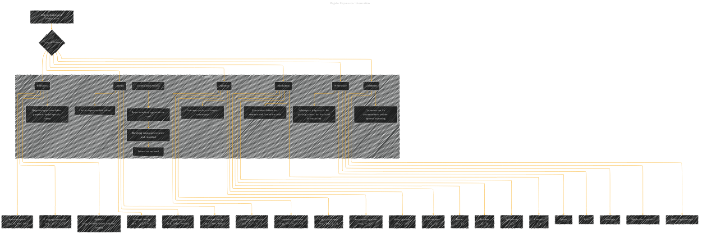

# Regular Expression Tokenization
> **Disclaimer:**
>
> This document contains my personal notes on the topic,
> compiled from publicly available documentation and various cited sources.
> The materials are intended for educational purposes, personal study, and reference.
> The content is dual-licensed:
> 1. **MIT License:** Applies to all code implementations (Swift, Mermaid, and other programming languages).
> 2. **Creative Commons Attribution 4.0 International License (CC BY 4.0):** Applies to all non-code content, including text, explanations, diagrams, and illustrations.
---

## Regular Expression Tokenization - A Diagram Structure

---

### Explanation

This diagram outlines the different types of tokens that can be generated during regular expression-based tokenization.  It categorizes these tokens into:

* **Keywords:** Reserved words with special meanings in the language (e.g., `if`, `for`, `while`).
* **Literals:**  Representing data values, including numeric (integers, floats), string (sequences of characters), and boolean (true/false) literals.
* **Operators:** Symbols used for arithmetic, comparison, logical, and assignment operations.
* **Punctuation:**  Marks like parentheses, braces, brackets, semicolons, and commas that structure the code.
* **Whitespace:** Spaces, tabs, and newlines are often ignored during the tokenization process itself but are vital for code readability.
* **Comments:**  Text annotations for documentation, typically ignored during parsing.

The diagram shows how regular expressions are used to match these patterns in the input code, resulting in a sequence of classified tokens. This sequence of tokens is the output of the tokenization process.  The diagram emphasizes the process from the input string to the output tokens, showcasing how regular expressions play a central role in identifying and classifying these different token types.

---
**Licenses:**

- **MIT License:**   - Full text in [LICENSE](LICENSE) file.
- **Creative Commons Attribution 4.0 International:**  - Legal details in [LICENSE-CC-BY](LICENSE-CC-BY) and at [Creative Commons official site](http://creativecommons.org/licenses/by/4.0/).

---