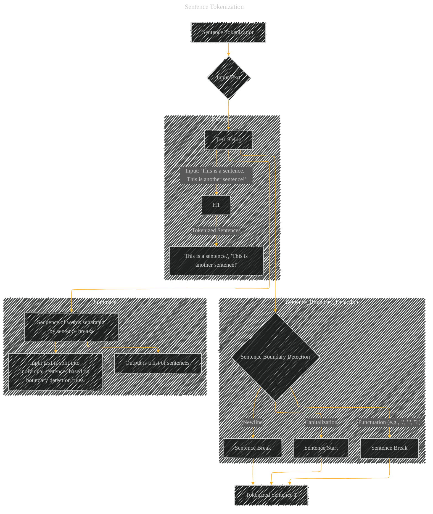

# Sentence Tokenization
> **Disclaimer:**
>
> This document contains my personal notes on the topic,
> compiled from publicly available documentation and various cited sources.
> The materials are intended for educational purposes, personal study, and reference.
> The content is dual-licensed:
> 1. **MIT License:** Applies to all code implementations (Swift, Mermaid, and other programming languages).
> 2. **Creative Commons Attribution 4.0 International License (CC BY 4.0):** Applies to all non-code content, including text, explanations, diagrams, and illustrations.
---

## Sentence Tokenization - A Diagram Structure

-----

### Explanation

*   **Input (B):** The input to sentence tokenization is a text string (C).

*   **Sentence Boundary Detection (D):**  This crucial step identifies where sentences end and begin.  The diagram shows three common cues:
    *   **Punctuation:**  Periods (.), exclamation points (!), and question marks (?) are strong indicators of sentence boundaries.
    *   **Capitalization:**  A new sentence often begins with a capital letter.
    *   **Newline:** A new line in the text often signifies a sentence boundary.

*   **Output (H):** The output of sentence tokenization is a list of tokenized sentences (e.g., "This is a sentence.", "This is another sentence!").

*   **Example (subgraph):** The example demonstrates how the input string "This is a sentence.  This is another sentence!" is broken down into two separate sentences.

----

### Important Considerations

*   **Ambiguity:** Some cases can be ambiguous. For example, abbreviations, initialisms, and certain punctuation usage might require more nuanced rules.
*   **Context:**  Complex sentence structures or specific domains (e.g., technical writing) might require domain-specific rules to ensure accurate sentence boundaries.
*   **Robustness:** The system should be designed to handle a variety of input formats and potentially noisy text.

This diagram effectively outlines the steps involved in sentence tokenization.  Adjustments to the rules within the `Sentence Boundary Detection` subgraph would be needed to account for specific requirements or ambiguities found in real-world text.

---
**Licenses:**

- **MIT License:**   - Full text in [LICENSE](LICENSE) file.
- **Creative Commons Attribution 4.0 International:**  - Legal details in [LICENSE-CC-BY](LICENSE-CC-BY) and at [Creative Commons official site](http://creativecommons.org/licenses/by/4.0/).

---