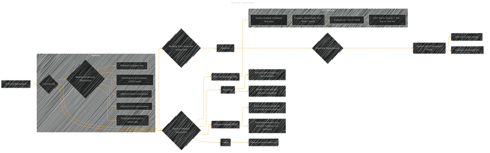

# Subword Tokenization
> **Disclaimer:**
>
> This document contains my personal notes on the topic,
> compiled from publicly available documentation and various cited sources.
> The materials are intended for educational purposes, personal study, and reference.
> The content is dual-licensed:
> 1. **MIT License:** Applies to all code implementations (Swift, Mermaid, and other programming languages).
> 2. **Creative Commons Attribution 4.0 International License (CC BY 4.0):** Applies to all non-code content, including text, explanations, diagrams, and illustrations.
---

## Subword Tokenization - A Diagram Structure

---

### Explanation

* **Subword Tokenization:** The overall concept of breaking down words into smaller units (subwords) to improve word representation.

* **Subwords:** The smaller units derived from the tokenization process.

* **Improving Representation:** Subword tokenization aims to improve how words are represented in the model, specifically handling rare or out-of-vocabulary words more effectively.

* **Handles Out-of-Vocabulary Words:** A crucial benefit; subwords allow models to handle words not present in the training dataset.

* **Types of Subword Tokenization:** Different methods exist for creating subwords.

    * **Byte Pair Encoding (BPE):**  Iteratively merges frequent byte pairs to create subwords.  The example shows the initial tokens being merged into new subwords based on frequency.

    * **WordPiece:** A method based on word frequency and likelihood, aiming to model word components.

    * **Unigram Language Model:** A tokenization method that uses a language model to predict the probability of each subword, allowing for more complex tokenization.

    * **Others:**  A catch-all category for various other character-based or other types of subword tokenization methods.

* **Benefits:** Summarizes the key advantages of subword tokenization, including better word representation, handling of OOV words, and improved model performance.

----

### Further Considerations

*   **Context:** The specific details of the tokenization method (BPE, WordPiece, etc.) will influence the types of subwords created and the performance characteristics of the model.
*   **Vocabulary Size:** The vocabulary size can be controlled to some extent by the tokenization method (e.g., limiting the number of merges in BPE).
*   **Performance Trade-offs:** Different subword tokenization methods will have different computational costs.

This diagram provides a structured overview of subword tokenization, highlighting the key concepts, types, and advantages.  You can adapt and expand on this structure to represent specific details or complexities of particular subword tokenization algorithms.  Remember to include specific examples or equations when relevant for each method.

---
**Licenses:**

- **MIT License:**   - Full text in [LICENSE](LICENSE) file.
- **Creative Commons Attribution 4.0 International:**  - Legal details in [LICENSE-CC-BY](LICENSE-CC-BY) and at [Creative Commons official site](http://creativecommons.org/licenses/by/4.0/).

---